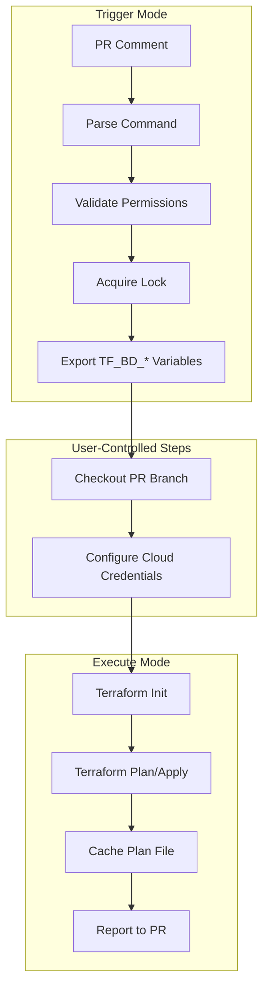

# Terraform Branch Deploy

Terraform Branch Deploy is a deployment control plane for Terraform infrastructure on GitHub Actions. It replaces ad-hoc CI/CD pipelines with a deterministic, auditable workflow that treats infrastructure changes as first-class deployment events.

This system is designed for platform engineering teams operating in environments where infrastructure changes require explicit validation, controlled execution, and clear accountability. It is not a convenience wrapper—it is a deployment primitive for production infrastructure.

---

## The Problem

Infrastructure automation on GitHub Actions typically follows one of two patterns, both with fundamental limitations.

**Apply-on-merge** workflows execute `terraform apply` automatically when code lands on the main branch. This approach conflates code approval with deployment approval. You merge hoping the plan you reviewed yesterday still applies today, despite potential state drift, concurrent changes, or upstream modifications. Failure is discovered after the fact, in production.

**Manual console workflows** require operators to execute Terraform locally or through a dedicated interface. This provides control but sacrifices auditability, reproducibility, and the ability to enforce organizational policy at scale. Knowledge of what was deployed, when, and by whom is fragmented across terminals and chat logs.

Neither pattern provides what production infrastructure requires: a system where intent is declared, validated, and executed as a single atomic workflow—with every step recorded in the pull request where the change originated.

---

## The Model

Terraform Branch Deploy implements a two-phase deployment lifecycle: **planning** and **execution**.

A deployment begins when an operator posts a command to a pull request. The system parses the intent, validates permissions, and acquires an exclusive lock on the target environment. It then executes `terraform plan` against the current state and records the output as a cached plan file, addressable by the commit SHA.

Execution occurs only after the operator explicitly approves the plan by issuing an apply command. The system retrieves the cached plan, validates that it corresponds to the current commit, and executes `terraform apply` against that exact plan—not a new one generated at apply time. This guarantees that the infrastructure change reviewed by the operator is precisely the change applied to production.

This separation between planning and execution is not merely organizational. It is the mechanism by which the system achieves determinism. The plan is an artifact. The apply is a controlled release of that artifact.

---

## Operational Context

This system is built for teams where:

- Infrastructure changes require peer review and explicit approval
- Multiple engineers may operate on the same environments concurrently
- Deployments must be auditable for compliance or incident analysis
- Short-lived credentials and OIDC authentication are required
- The blast radius of a failed deployment justifies explicit safeguards

It assumes familiarity with Terraform, GitHub Actions, and cloud IAM patterns. It does not attempt to hide complexity—it provides the primitives necessary to manage complexity systematically.

---

## Execution Model

The action operates in two distinct modes within a single workflow.

**Trigger mode** is stateless and fast. It parses the incoming comment, determines the operation type, validates the requesting user's permissions, and acquires a distributed lock on the target environment. If all checks pass, it exports the deployment context as environment variables and signals the workflow to proceed. No privileged credentials are used in this phase.

**Execute mode** is stateful and privileged. It assumes the workflow has already checked out the correct ref and authenticated with the target cloud provider. It runs `terraform init` and either `plan` or `apply` depending on the operation. Results are reported back to the pull request as structured comments.

This separation allows organizations to gate cloud credentials behind explicit workflow conditions. The trigger phase can run on any event; the execute phase runs only when a deployment has been authorized.



---

## Safety Guarantees

The system enforces several invariants to prevent accidental or unauthorized infrastructure changes.

**Plan-apply correspondence**: An apply command will fail if no plan file exists for the current commit. If the branch has been updated since planning, the operator must re-plan before applying. This prevents the common failure mode of applying stale plans.

**Environment locking**: Only one deployment can execute against a given environment at a time. Locks are acquired at the start of the trigger phase and released when the deployment completes or fails. This eliminates state corruption from concurrent applies.

**Checksum verification**: Plan files are checksummed at creation. Before applying, the system verifies the checksum matches. Any modification to the plan file—whether accidental or malicious—causes the apply to abort.

**Explicit rollback**: The command `.apply main to <env>` deploys the stable main branch to the target environment, bypassing the normal plan requirement. This emergency latch is intentional—it provides a fast path to known-good state during incidents.

---

## Configuration

The system is configured through a YAML file at the repository root: `.tf-branch-deploy.yml`.

```yaml
default-environment: dev
production-environments: [prod]

environments:
  dev:
    working-directory: terraform/environments/dev
  prod:
    working-directory: terraform/environments/prod
```

Each environment specifies its working directory and may override var files, backend configurations, and Terraform arguments. The configuration schema is validated at runtime; malformed configurations produce actionable error messages.

---

## Workflow Integration

A minimal workflow invokes the action twice: once to trigger, once to execute.

```yaml
name: deploy
on:
  issue_comment:
    types: [created]

permissions:
  pull-requests: write
  contents: write
  deployments: write
  id-token: write

jobs:
  deploy:
    if: github.event.issue.pull_request
    runs-on: ubuntu-latest
    steps:
      # Initial checkout to read .tf-branch-deploy.yml
      - uses: actions/checkout@v4

      - uses: scarowar/terraform-branch-deploy@v0
        id: trigger
        with:
          mode: trigger
          github-token: ${{ secrets.GITHUB_TOKEN }}

      # Checkout the PR branch for Terraform execution
      - uses: actions/checkout@v4
        if: env.TF_BD_CONTINUE == 'true'
        with:
          ref: ${{ env.TF_BD_REF }}

      - uses: aws-actions/configure-aws-credentials@v4
        if: env.TF_BD_CONTINUE == 'true'
        with:
          role-to-assume: arn:aws:iam::${{ vars.AWS_ACCOUNT_ID }}:role/deploy-${{ env.TF_BD_ENVIRONMENT }}
          aws-region: us-east-1

      - uses: scarowar/terraform-branch-deploy@v0
        if: env.TF_BD_CONTINUE == 'true'
        with:
          mode: execute
          github-token: ${{ secrets.GITHUB_TOKEN }}
```

The initial checkout is required for trigger mode to read the `.tf-branch-deploy.yml` configuration file. The second checkout retrieves the PR branch for Terraform execution.

---

## Commands

Operators interact with the system through pull request comments.

| Command | Behavior |
|---------|----------|
| `.plan to <env>` | Execute `terraform plan`, cache the result, report output |
| `.apply to <env>` | Execute `terraform apply` against the cached plan |
| `.apply main to <env>` | Deploy the main branch directly (emergency rollback) |
| `.lock <env>` | Acquire an exclusive lock on the environment |
| `.unlock <env>` | Release the environment lock |
| `.wcid` | Report current lock status across all environments |
| `.help` | Display available commands |

Extra arguments are passed through to Terraform using a pipe separator:

```
.plan to prod | -target=module.database
```

---

## Documentation

This README establishes the conceptual foundation. Detailed reference material is maintained separately.

| Document | Purpose |
|----------|---------|
| [Getting Started](docs/getting-started/index.md) | Initial setup and first deployment |
| [Configuration Reference](docs/reference/configuration.md) | Complete schema documentation |
| [Action Inputs](docs/reference/inputs.md) | All action inputs and defaults |
| [Troubleshooting](docs/troubleshooting.md) | Common issues and resolutions |

The documentation follows a strict separation of concerns. This README answers "what is this and why does it exist." The reference documentation answers "how do I configure and operate it." Tutorials and guides answer "how do I accomplish specific tasks."

---

## License

MIT
