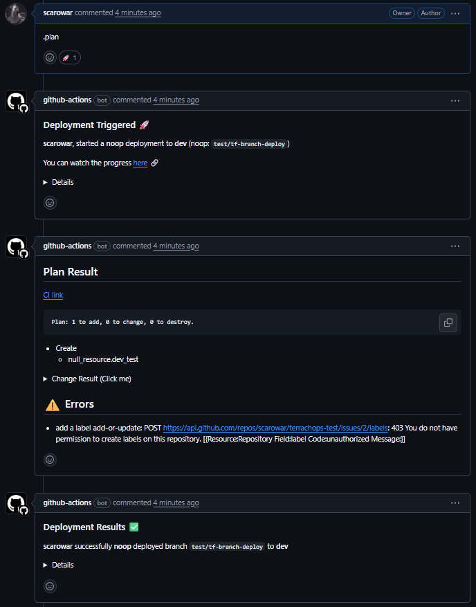
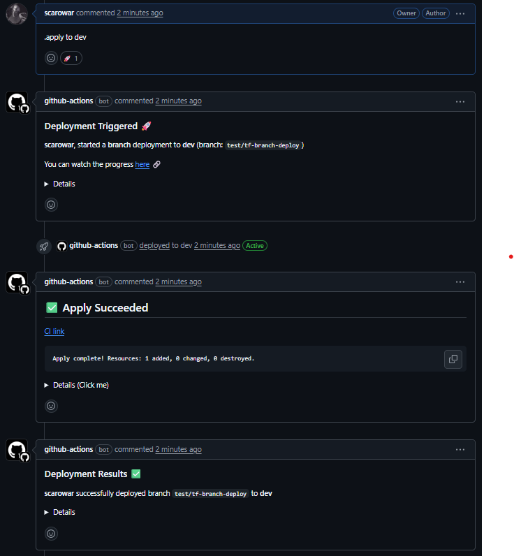
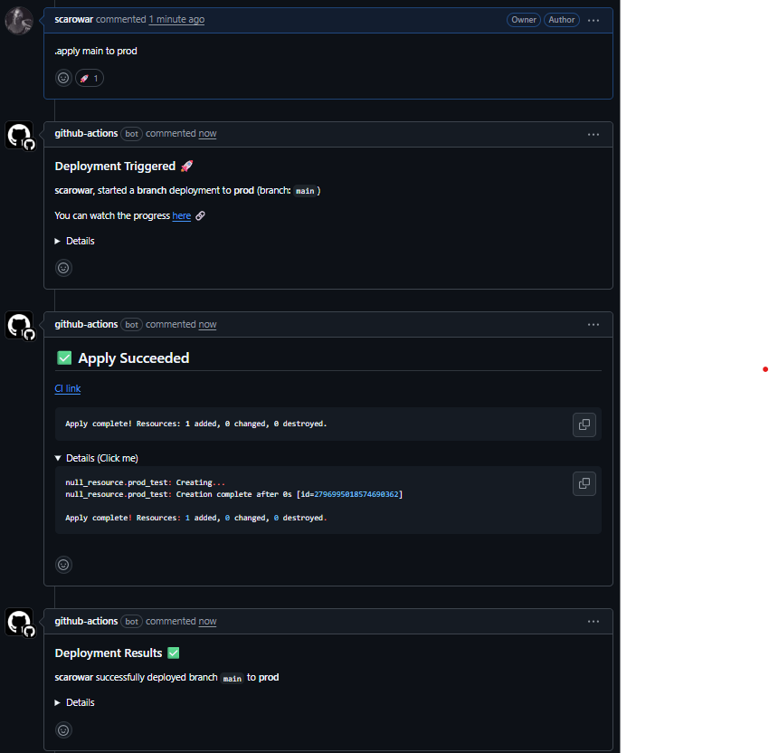
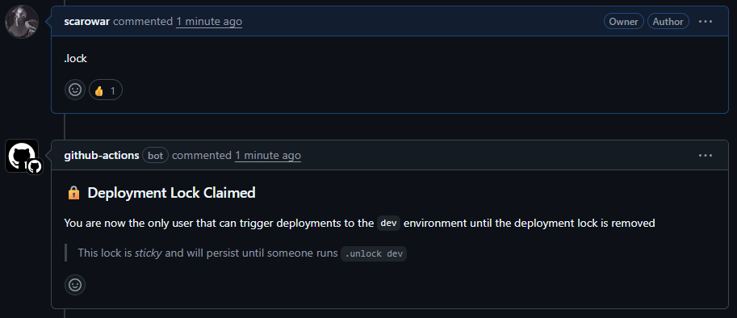
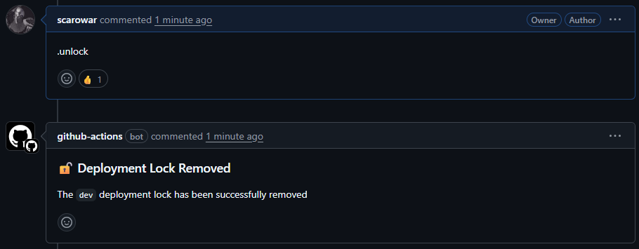

# Terraform Branch Deploy Action 🚀


[](https://scorecard.dev/viewer/?uri=github.com/scarowar/terraform-branch-deploy)
[](https://sonarcloud.io/summary/new_code?id=scarowar_terraform-branch-deploy)


[](https://results.pre-commit.ci/latest/github/scarowar/terraform-branch-deploy/main)


A GitHub Action and IssueOps integration for automated Terraform deployments.
---

Building on the foundation of [branch-deploy](https://github.com/github/branch-deploy), this action enables branch-based Terraform deployments.

- 💬 Trigger Terraform plans and applies directly from PR comments using ChatOps commands.
- ⚙️ Customize environments, arguments, and more with a highly configurable `.tf-branch-deploy.yml`.
- 🔒 Enforce PR review and CI status checks before deployment with branch protection awareness.
- 🛡️ Prevent conflicting deployments and ensure environment stability with deployment locks.
- 🌍 Deploy Terraform to multiple environments, each with tailored configurations.
- ➕ Pass extra Terraform CLI arguments securely via comments for dynamic operations.
- 🔄 Promote or roll back to a stable state with branch rollbacks.
- ✅ Run essential Terraform format and validation checks before any operation.

## Available Commands 💬

Interact with `terraform-branch-deploy` by commenting on your Pull Requests.

- `.plan` — Run `terraform plan` for the default environment (noop mode).
- `.apply` — Run `terraform apply` for the default environment (requires prior
  successful `.plan`).
- `.plan to <environment>` — Run `terraform plan` for a specific environment.
- `.apply to <environment>` — Run `terraform apply` for a specific environment
  (requires prior successful `.plan`).
- `.apply <branch> to <environment>` — Rollback from a branch to an environment
  (no prior plan required).
- `.apply <branch>` — Rollback the default environment to a branch (no prior plan
  required).
---
- `.lock` — Obtain the deployment lock for the default environment.
- `.lock --reason <text>` — Obtain the deployment lock for the default
  environment with a reason.
- `.lock <environment>` — Obtain the deployment lock for a specific environment.
- `.lock <environment> --reason <text>` — Obtain the deployment lock for a
  specific environment with a reason.
- `.lock --global` — Obtain a global deployment lock.
- `.lock --global --reason <text>` — Obtain a global deployment lock with a
  reason.
---
- `.unlock` — Release the deployment lock for the default environment.
- `.unlock <environment>` — Release the deployment lock for a specific
  environment.
- `.unlock --global` — Release the global deployment lock.
---
- `.lock --details` — Show info about the current deployment lock for the default
  environment.
- `.lock <environment> --details` — Show info about the current deployment lock
  for a specific environment.
- `.lock --global --details` — Show info about the current global deployment
  lock.
- `.wcid` — Alias for `.lock --details` ("Where Can I Deploy?").
---
- `.help` — Show this help message.

> You can append extra Terraform CLI arguments to any of these commands using a pipe (`|`):
> `.plan`, `.plan to <environment>`, `.apply`, `.apply to <environment>`, `.apply <branch>`, `.apply <branch> to <environment>`
>
> Examples:  `.plan | -var=env=dev`, `.apply | -target=module.example`

## Demo 🎥

A video demo showing Terraform Branch Deploy in action

[Terraform Branch Deploy Demo](https://github.com/user-attachments/assets/15b1c060-9be5-4203-9c5d-caa088c2535d)

## Get Started 💪

### 1. Create your GitHub Actions Workflow file (e.g., .github/workflows/terraform-deploy.yml) 📝

This workflow processes comments on Pull Requests, triggering your `terraform-branch-deploy` action which then orchestrates the full Terraform operation.

```yaml
name: "Terraform Branch Deploy"

# This workflow executes on `issue_comment` events when a comment is created.
on:
  issue_comment:
    types: [created]

permissions:
  pull-requests: write   # Required for posting comments and reactions
  deployments: write     # Required for updating GitHub deployment statuses
  contents: write        # Required for creating/managing deployment lock branches and tags
  checks: read           # Required for checking CI check status before deployments
  statuses: read         # Required for reading commit statuses

jobs:
  terraform_deployment:
    # This job only runs if the comment was made on a Pull Request.
    if: ${{ github.event.issue.pull_request }}
    runs-on: ubuntu-latest # Or your preferred runner image (e.g., self-hosted)

    steps:
      # --- Include the authentication step here (e.g., AWS, Azure, GCP, Terraform Cloud) ---

      - name: "Run Terraform Branch Deploy Action"
        uses: scarowar/terraform-branch-deploy@v0.1.0
        with:
          github-token: ${{ secrets.GITHUB_TOKEN }}
          # Optional: Override default action inputs here. Examples:
          # terraform-version: '1.7.5' # Specify a particular Terraform CLI version.
          # working-directory: 'infra/' # Default base path for your Terraform modules in the repository.
          # noop-trigger: '.tfplan' # Custom trigger for plan-only operations (default '.plan').
          # trigger: '.tfapply' # Custom trigger for apply operations (default '.apply').
          # stable_branch: 'master' # Your stable branch for rollback deployments (default 'main').
          # admins: 'octocat,my-org/tf-admins' # Whitelist users/teams for admin privileges.
          # admins_pat: ${{ secrets.ORG_ADMINS_PAT }} # Required if using org teams in 'admins' input.
```

### 2. Create your terraform-branch-deploy configuration file (.tf-branch-deploy.yml) ⚙️

This file should be placed in the root of your repository (`.tf-branch-deploy.yml`) and defines your environments, default values, and overrides for Terraform operations. If this file is not present, the action will default to a single environment named `production`.

For a comprehensive reference on all available configuration options and their validation rules, refer to the [`.tf-branch-deploy.schema.json`](https://github.com/scarowar/terraform-branch-deploy/blob/main/tf-branch-deploy.schema.json) JSON schema in the repository. For a more complete example, see [`.tf-branch-deploy.example.yml`](./.tf-branch-deploy.example.yml).


Create a `.tf-branch-deploy.yml` file in your repository root:

```yaml
# yaml-language-server: $schema=./tf-branch-deploy.schema.json
# Specifies the JSON schema for this configuration file, enabling IDE auto-completion and validation.

default-environment: dev # The default environment to target if not specified in an IssueOps command (e.g., just `.plan` or `.apply`).

production-environments: # A list of environment names that GitHub should consider 'production' for deployment tracking.
  - prod

defaults: # Default configurations that apply to all environments unless explicitly overridden.
  var-files: # Default Terraform variable files to be loaded for all environments.
    paths:
      - common.tfvars # Path to a common .tfvars file, relative to the working-directory of each environment.
  plan-args: # Default arguments for `terraform plan` command across all environments.
    args:
      - "-compact-warnings"

environments: # Environment-specific configurations, overriding or extending the 'defaults'.
  dev: # Configuration for the 'dev' environment.
    working-directory: ./terraform/dev # Path to the Terraform code for 'dev', relative to the repository root.
    backend-configs: # Backend configuration files specific to the 'dev' environment.
      paths:
        - ./terraform/dev/dev.s3.tfbackend
    var-files: # Variable files specific to the 'dev' environment.
      paths:
        - ./terraform/dev/dev.tfvars

  prod: # Configuration for the 'prod' environment.
    working-directory: ./terraform/prod # Path to the Terraform code for 'prod', relative to the repository root.
    backend-configs: # Backend configuration files specific to the 'prod' environment.
      paths:
        - ./terraform/prod/prod.s3.tfbackend
    var-files: # Variable files specific to the 'prod' environment.
      inherit: false # Set to 'false' to prevent inheriting 'common.tfvars' from 'defaults'.
      paths:
        - ./terraform/prod/prod.tfvars
        - ./terraform/prod/secrets.prod.tfvars
    plan-args: # Arguments for `terraform plan` specific to 'prod'.
      inherit: false # Set to 'false' to prevent inheriting 'plan-args' from 'defaults'.
      args:
        - "-parallelism=25"
    apply-args: # Arguments for `terraform apply` specific to 'prod'.
      args:
        - "-parallelism=10"
```

### 3. Trigger a deployment 🚦

To trigger a deployment, comment on a pull request with one of the [supported commands](#available-commands). For example:

- **`.plan`**: To run a `terraform plan` for your `default-environment` (e.g., `dev`).
<p align="left">
  
</p>

- **`.apply to dev`**: To run a `terraform apply` for the `dev` environment (requires a prior successful `.plan to dev`).
<p align="left">
  
</p>

- **`.apply main to prod`**: To roll back the `prod` environment to the state of the `main` branch.
<p align="left">
  
</p>

- **`.lock`**: To obtain a deployment lock for your `default-environment` (e.g., `dev`). This prevents other deployments to the same environment until the lock is released.
<p align="left">
  
</p>

- **`.unlock`**: To release a deployment lock for your `default-environment` (e.g., `dev`) if lock exists. This allows subsequent deployments to proceed.
<p align="left">
  
</p>


## Core Concepts 💡

*This section is adapted from the* [*branch-deploy repository's README*](https://github.com/github/branch-deploy?tab=readme-ov-file#about-)*.*

Before we get into details, let's first define a few key terms below:

- **IssueOps** - It's like ChatOps, but instead of using a chat bot, commands are invoked by commenting on a GitHub Pull Request (PRs are issues under the hood). Example: commenting `.plan` or `.apply` on a pull request.
- **Branch Deployment** - A deployment methodology that enables you to deploy a specific branch (or pull request) to a desired Terraform environment *before* merging to `main` or `master`. This allows for pre-merge validation of infrastructure changes.
- **PR** - Short for Pull Request.

### IssueOps 🗨️

The best way to define IssueOps is to compare it to something similar: ChatOps. You may be familiar with the concept of ChatOps already, but in case you aren't, here is a quick definition:

> ChatOps is the process of interacting with a chat bot to execute commands directly in a chat platform. For example, with ChatOps you might do something like `.ping example.org` to check the status of a website.

IssueOps adopts the same mindset but through a different medium. Rather than using a chat service to invoke commands, we use comments on a GitHub Issue or Pull Request. GitHub Actions serves as the runtime that executes our desired logic.

### Branch Deployments 🌲

Branch deployments are a battle-tested way of deploying your changes to a given environment for a variety of reasons. For Terraform users, branch deployments allow you to do the following:

- Deploy your infrastructure changes to production **before** merging your code.
- Deploy infrastructure changes to a staging, QA, or other non-production environment for isolated testing.

#### Branch Deployment Core Concepts ⭐

> Note: The `main` branch is considered the base repository branch below.

- The `main` branch is always considered to be a stable and deployable branch for your Terraform infrastructure.
- All infrastructure changes are deployed to a target environment **before** they are merged to the `main` branch.
- To roll back a branch deployment (e.g., in a production environment), you deploy the `main` branch to that environment.
- `noop` deployments (i.e., `terraform plan`) should not make changes but rather report what they "would" have done, and typically do not require approval or review before starting.

#### Why use branch deployments ❓

> To put the **merge -> deploy** model in the past for your infrastructure changes!

What if your Terraform changes are bad and you broke production with the **merge -> deploy** model? Well, now you have to revert your PR, get passing CI/builds, and then re-merge your changes to get back to a stable environment. With the ***\*branch deploy\**** model, this is almost never the case for your infrastructure. The `main` branch is considered to be always safe and stable.


## Inputs 📥

The `terraform-branch-deploy` action accepts the following inputs:

| **Input Name**      | **Description**                                              | **Required** | **Default** | **Example**                   |
| ------------------- | ------------------------------------------------------------ | ------------ | ----------- | ----------------------------- |
| `github-token`      | The GitHub token for authentication. **Requires `contents: write`, `pull-requests: write`, `actions: read`, and `deployments: write` permissions.** | `true`       |             | `${{ secrets.GITHUB_TOKEN }}` |
| `terraform-version` | The version of Terraform CLI to install. Can be a full version string (e.g., `'1.5.7'`), a constraint string (e.g., `'<1.13.0'`), or `'latest'`. | `false`      | `'latest'`  | `'1.7.5'`                     |
| `working-directory` | The default path to the Terraform code, **relative to the repository root**. This can be overridden per environment in your `.tf-branch-deploy.yml` configuration. | `false`      | `'.'`       | `'infra/'`                    |
| `noop-trigger`      | The comment trigger (e.g., `.plan`) that initiates a Terraform plan, operating in **"noop" mode** (shows changes without applying). | `false`      | `'.plan'`   | `'.tfplan'`                   |
| `trigger`           | The comment trigger (e.g., `.apply`) that initiates a Terraform apply operation. | `false`      | `'.apply'`  | `'.tfapply'`                  |
| `stable_branch`     | The name of the stable branch (e.g., `'main'`, `'develop'`) used as a reference for rollback deployments. | `false`      | `'main'`    | `'production'`                |
| `skip`              | If `true`, the action will only extract the target environment, command details, and related info, then exit early. Useful for advanced usage with environment-scoped secrets. | `false`      | `'false'`   | `'true'`                      |
| `admins`            | A comma-separated list of GitHub usernames or teams (e.g., `'monalisa,octocat,my-org/my-team'`) considered administrators. **Admins can deploy without branch protection approvals.** | `false`      | `'false'`   | `'octocat,team-x'`            |
| `admins_pat`        | A GitHub personal access token with **`read:org` scopes**. This is only needed if using the `admins` input with a GitHub organization team (e.g., `'my-org/my-team'`). | `false`      | `'false'`   | `ghp_xxx`                     |


## Troubleshooting & Support 🛠️

- For common issues, see [GitHub Discussions](https://github.com/scarowar/terraform-branch-deploy/discussions) or open an [issue](https://github.com/scarowar/terraform-branch-deploy/issues).
- For bug reports, feature requests, or questions, use the provided [issue templates](.github/ISSUE_TEMPLATE/).
- For security concerns, see [SECURITY.md](./SECURITY.md).


## Contributing 🤝

Contributions are welcome! Please see [CONTRIBUTING.md](./CONTRIBUTING.md) for guidelines, code style, and how to run pre-commit checks.


## License 📄

MIT License. See [LICENSE](./LICENSE).


## Acknowledgements & References 🙏

- [IssueOps](https://issue-ops.github.io/docs/): ChatOps for GitHub Actions.
- [branch-deploy](https://github.com/github/branch-deploy): Enables branch deployments through IssueOps.
- [tfcmt](https://github.com/suzuki-shunsuke/tfcmt): Enables posting the result of `terraform plan` and `terraform apply` to GitHub Pull Requests as a comment.
