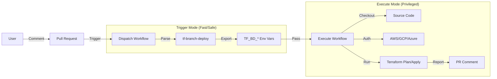

<picture>
  <source media="(prefers-color-scheme: dark)" srcset="docs/assets/images/cover-dark.png">
  <source media="(prefers-color-scheme: light)" srcset="docs/assets/images/cover-light.png">
  
</picture>

<p align="center">
  <a href="https://github.com/scarowar/terraform-branch-deploy/actions/workflows/ci.yml"></a>
  <a href="https://github.com/scarowar/terraform-branch-deploy/blob/main/LICENSE"></a>
</p>

# Terraform Branch Deploy

**The authoritative GitOps platform for Terraform on GitHub Actions.**

Terraform Branch Deploy (v0.2.0) transforms GitHub Actions into a secure, interactive control plane for infrastructure. It replaces fragile "apply-on-merge" workflows with a deterministic, PR-centric lifecycle designed for platform engineering teams.

## The Problem

Traditional CI/CD for Terraform is often broken:
*   **Blind Merges**: "Apply on merge" means you merge code without proving it works.
*   **Console Noise**: Debugging requires digging through thousands of lines of raw logs.
*   **Race Conditions**: Multiple engineers deploying to `dev` simultaneously corrupt state.
*   **Security Gaps**: Long-lived credentials are often exposed to untrusted workflows.

## The Solution

We treat infrastructure changes as a conversation. You declare intent (`.plan`), the system validates it, and you execute against that exact validated state (`.apply`).

*   **Interactive**: drive deployments via PR comments.
*   **Deterministic**: the plan you review is exactly what gets applied (SHA-pinned).
*   **Secure**: short-lived OIDC credentials, injected only when needed.
*   **Exclusive**: distributed locking ensures only one deployment happens at a time.

## Architecture

This action operates in two distinct modes to balance security and performance:



1.  **Trigger Mode**: fast, stateless. Parses commands, checks permissions, acquires locks, and exports configuration.
2.  **Execute Mode**: privileged, stateful. Checks out code, assumes IAM roles, runs Terraform, and reports results.

## Getting Started

### Prerequisites
*   A GitHub App or PAT for writing PR comments.
*   An S3/GCS backend for Terraform state.
*   OpenID Connect (OIDC) configured for your cloud provider.

### 1. Configuration
Create `.tf-branch-deploy.yml` in your repository root:

```yaml
default-environment: dev
production-environments: [prod]

environments:
  dev:
    working-directory: terraform/environments/dev
  prod:
    working-directory: terraform/environments/prod
```

### 2. Workflow
Create `.github/workflows/deploy.yml`. This usage pattern ensures security best practices:

```yaml
name: Terraform Deploy
on:
  issue_comment:
    types: [created]

permissions:
  pull-requests: write
  contents: write
  deployments: write
  id-token: write # Required for OIDC

jobs:
  deploy:
    if: github.event.issue.pull_request
    runs-on: ubuntu-latest
    steps:
      # 1. TRIGGER: Parse command and lock environment
      - uses: scarowar/terraform-branch-deploy@v0.2.0
        id: trigger
        with:
          mode: trigger
          github-token: ${{ secrets.GITHUB_TOKEN }}

      # 2. CHECKOUT: Checkout the specific ref from the trigger
      - uses: actions/checkout@v4
        if: env.TF_BD_CONTINUE == 'true'
        with:
          ref: ${{ env.TF_BD_REF }}

      # 3. AUTH: Assume role based on target environment
      - uses: aws-actions/configure-aws-credentials@v4
        if: env.TF_BD_CONTINUE == 'true'
        with:
          role-to-assume: arn:aws:iam::123456789012:role/github-actions-${{ env.TF_BD_ENVIRONMENT }}
          aws-region: us-east-1

      # 4. EXECUTE: Run Terraform and report results
      - uses: scarowar/terraform-branch-deploy@v0.2.0
        if: env.TF_BD_CONTINUE == 'true'
        with:
          mode: execute
          github-token: ${{ secrets.GITHUB_TOKEN }}
```

## Usage

Control your infrastructure directly from the Pull Request:

*   **Plan**: `.plan to dev`
    *   Generates a distinct plan file.
    *   Posts a "Deployment Results" summary with the plan output.
*   **Apply**: `.apply to dev`
    *   Verifies the plan exists and matches the current commit.
    *   Applies the changes and reports status.
*   **Unlock**: `.unlock dev`
    *   Forces a release of the environment lock (normally automatic).
*   **Rollback**: `.apply main to prod`
    *   Emergency latch. Deploys the stable `main` branch to production immediately.

## Production Readiness

This project is built for high-stakes environments where failure is not an option.

### Safety
*   **Plan matching**: `.apply` will strictly fail if the plan file is missing or stale.
*   **Context awareness**: The action prevents deploying to `prod` if the PR is not targeting the `main` branch (configurable).

### Determinism
*   We do not simply run `terraform apply -auto-approve`. We run `terraform apply planfile`.
*   This guarantees that exactly what you reviewed is what gets provisioned.

### Observability
*   **Rich Reporting**: Deployment results are summarized in clear, formatted comments.
*   **Clean Logs**: Sensitive inputs are masked; noisy API calls are silenced.

## Documentation

For advanced configuration, policy enforcement, and architecture deep dives, consult the full documentation:

[**View Full Documentation**](https://scarowar.github.io/terraform-branch-deploy/)
