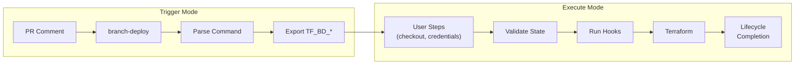

<picture>
  <source media="(prefers-color-scheme: dark)" srcset="docs/assets/images/cover-dark.png">
  <source media="(prefers-color-scheme: light)" srcset="docs/assets/images/cover-light.png">
  
</picture>

<p align="center">
  <a href="https://github.com/scarowar/terraform-branch-deploy/actions/workflows/ci.yml"></a>
  <a href="https://github.com/scarowar/terraform-branch-deploy/actions/workflows/codeql.yml"></a>
  <a href="https://api.scorecard.dev/projects/github.com/scarowar/terraform-branch-deploy"></a>
  <a href="https://github.com/scarowar/terraform-branch-deploy/blob/main/LICENSE"></a>
</p>

<p align="center">
  <a href="https://scarowar.github.io/terraform-branch-deploy/">Documentation</a> •
  <a href="https://scarowar.github.io/terraform-branch-deploy/getting-started/">Getting Started</a> •
  <a href="https://scarowar.github.io/terraform-branch-deploy/examples/">Examples</a>
</p>

---

A GitHub Action that enables Terraform deployments via PR comments. Built on top of [github/branch-deploy](https://github.com/github/branch-deploy), it adds Terraform-specific features like plan caching, environment configuration, lifecycle hooks, and credential injection points.

## Why This Action?

| Without terraform-branch-deploy | With terraform-branch-deploy |
|--------------------------------|------------------------------|
| Multiple workflows for plan/apply | Single workflow handles everything |
| Manual plan file management | Automatic plan caching with SHA verification |
| Environment config scattered in workflows | Centralized `.tf-branch-deploy.yml` |
| No enforcement of plan-before-apply | Built-in safety: apply requires matching plan |
| Custom locking implementation | Environment locking via branch-deploy |
| Hardcoded cloud credentials | Environment-aware credential injection |

## Commands

```text
.plan to dev              # Preview changes
.apply to dev             # Deploy changes
.lock dev                 # Lock environment
.unlock dev               # Release lock
.wcid                     # Who's deploying?
.apply main to prod       # Emergency rollback
```

## Quick Start

**1. Create workflow** (`.github/workflows/deploy.yml`)

```yaml
name: Terraform Deploy
on:
  issue_comment:
    types: [created]

permissions:
  contents: write
  pull-requests: write
  deployments: write
  id-token: write  # For OIDC credential injection

jobs:
  deploy:
    if: github.event.issue.pull_request
    runs-on: ubuntu-latest
    steps:
      # TRIGGER: Parse command, export TF_BD_* env vars
      - uses: scarowar/terraform-branch-deploy@v0.2.0
        with:
          mode: trigger
          github-token: ${{ secrets.GITHUB_TOKEN }}
      
      # CHECKOUT: Use TF_BD_REF (handles rollbacks correctly)
      - uses: actions/checkout@v4
        if: env.TF_BD_CONTINUE == 'true'
        with:
          ref: ${{ env.TF_BD_REF }}
      
      # CREDENTIALS: Based on TF_BD_ENVIRONMENT
      - uses: aws-actions/configure-aws-credentials@v4
        if: env.TF_BD_CONTINUE == 'true'
        with:
          role-to-assume: arn:aws:iam::${{ env.TF_BD_ENVIRONMENT == 'prod' && '111111111111' || '222222222222' }}:role/terraform
          aws-region: us-east-1
      
      # EXECUTE: Run terraform, complete lifecycle
      - uses: scarowar/terraform-branch-deploy@v0.2.0
        if: env.TF_BD_CONTINUE == 'true'
        with:
          mode: execute
          github-token: ${{ secrets.GITHUB_TOKEN }}
```

**2. Create config** (`.tf-branch-deploy.yml`)

```yaml
default-environment: dev
production-environments: [prod]

environments:
  dev:
    working-directory: terraform/dev
  prod:
    working-directory: terraform/prod
```

**3. Comment on a PR**: `.plan to dev`

## Architecture



### Two Modes

| Mode | Purpose |
|------|---------|
| `trigger` | Parse command, export 14 `TF_BD_*` env vars, STOP |
| `execute` | Validate state, run hooks, terraform, complete lifecycle |

### Environment Variables (from trigger mode)

| Variable | Description | Example |
|----------|-------------|---------|
| `TF_BD_CONTINUE` | Should deployment proceed? | `true` |
| `TF_BD_ENVIRONMENT` | Target environment | `dev`, `prod` |
| `TF_BD_OPERATION` | Operation type | `plan`, `apply`, `rollback` |
| `TF_BD_IS_ROLLBACK` | Rollback flag | `true`, `false` |
| `TF_BD_SHA` | Commit SHA | `abc123def456` |
| `TF_BD_REF` | Branch to checkout | `feature/foo`, `main` |
| `TF_BD_ACTOR` | User who triggered | `username` |
| `TF_BD_PR_NUMBER` | Pull request number | `42` |
| `TF_BD_PARAMS` | Extra args from command | `-target=module.foo` |
| `TF_BD_DEPLOYMENT_ID` | GitHub deployment ID | `12345` |

## Lifecycle Hooks

Define hooks in `.tf-branch-deploy.yml`:

```yaml
hooks:
  pre-init:
    - name: "Security Scan"
      run: trivy fs --security-checks vuln,secret .
      fail-on-error: true
  
  pre-plan:
    - name: "TFLint"
      run: tflint --config .tflint.hcl
  
  post-plan:
    - name: "Cost Estimation"
      run: infracost diff --path .
      condition: plan-only
  
  post-apply:
    - name: "Update CMDB"
      run: ./scripts/update-cmdb.sh
      condition: apply-only
```

### Hook Phases

| Phase | When | Examples |
|-------|------|----------|
| `pre-init` | Before terraform init | trivy, gitleaks |
| `post-init` | After terraform init | terraform validate |
| `pre-plan` | Before terraform plan/apply | tflint, checkov |
| `post-plan` | After terraform plan | infracost |
| `post-apply` | After terraform apply | terraform-docs, CMDB |

### Hook Properties

| Property | Default | Description |
|----------|---------|-------------|
| `name` | required | Human-readable name |
| `run` | required | Shell command |
| `fail-on-error` | `true` | Block on failure |
| `timeout` | `600` | Max seconds |
| `condition` | `always` | `always`, `plan-only`, `apply-only`, `rollback-only` |

## Inputs

| Input | Required | Default | Description |
|-------|----------|---------|-------------|
| `mode` | Yes | | `trigger` or `execute` |
| `github-token` | Yes | | GitHub token with PR write access |
| `config-path` | No | `.tf-branch-deploy.yml` | Path to config file |
| `terraform-version` | No | `latest` | Terraform version to install |
| `pre-terraform-hook` | No | | Quick inline hook (alternative to config) |
| `dry-run` | No | `false` | Print commands without executing |

## Outputs

| Output | Description |
|--------|-------------|
| `continue` | `true` if deployment should proceed |
| `environment` | Target environment |
| `operation` | `plan`, `apply`, or `rollback` |
| `is-rollback` | `true` if rollback operation |
| `ref` | Branch ref to checkout |
| `sha` | Commit SHA |
| `has-changes` | `true` if plan has changes |
| `plan-file` | Path to generated plan file |

## Documentation

| Guide | Description |
|-------|-------------|
| [Getting Started](https://scarowar.github.io/terraform-branch-deploy/getting-started/) | First deployment in 5 minutes |
| [Configuration](https://scarowar.github.io/terraform-branch-deploy/guides/configuration/) | `.tf-branch-deploy.yml` reference |
| [Modes](https://scarowar.github.io/terraform-branch-deploy/guides/modes/) | Trigger vs Execute |
| [Lifecycle Hooks](https://scarowar.github.io/terraform-branch-deploy/guides/hooks/) | Pre/post terraform hooks |
| [Guardrails & Security](https://scarowar.github.io/terraform-branch-deploy/guides/guardrails/) | Enterprise governance |
| [Examples](https://scarowar.github.io/terraform-branch-deploy/examples/) | Workflow snippets |

## Contributing

Contributions are welcome! Please read [CONTRIBUTING.md](CONTRIBUTING.md) for guidelines.

## License

This project is licensed under the MIT License. See the [LICENSE](LICENSE) file for details.
