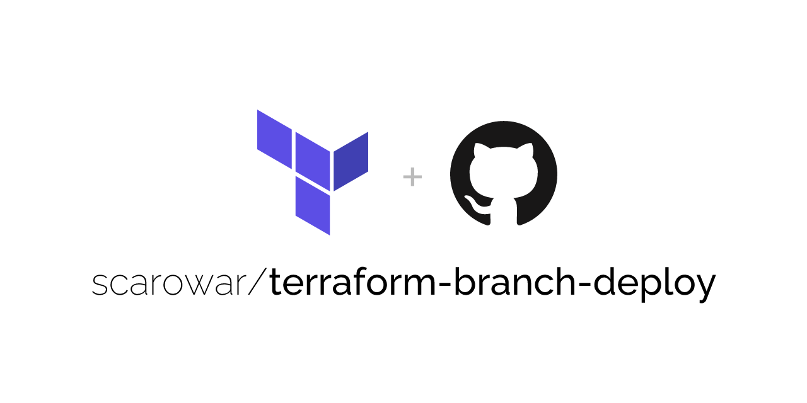
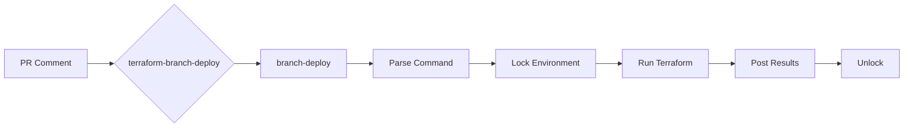

<picture>
  <source media="(prefers-color-scheme: dark)" srcset="docs/assets/images/cover-dark.png">
  <source media="(prefers-color-scheme: light)" srcset="docs/assets/images/cover-light.png">
  
</picture>

<p align="center">
  <a href="https://github.com/scarowar/terraform-branch-deploy/actions/workflows/ci.yml"></a>
  <a href="https://github.com/scarowar/terraform-branch-deploy/actions/workflows/codeql.yml"></a>
  <a href="https://api.scorecard.dev/projects/github.com/scarowar/terraform-branch-deploy"></a>
  <a href="https://github.com/scarowar/terraform-branch-deploy/blob/main/LICENSE"></a>
</p>

<p align="center">
  <a href="https://scarowar.github.io/terraform-branch-deploy/">Documentation</a> •
  <a href="https://scarowar.github.io/terraform-branch-deploy/getting-started/">Getting Started</a> •
  <a href="https://scarowar.github.io/terraform-branch-deploy/examples/">Examples</a>
</p>

---

A GitHub Action that enables Terraform deployments via PR comments. Built on top of [github/branch-deploy](https://github.com/github/branch-deploy), it adds Terraform-specific features like plan caching, environment configuration, and pre-terraform hooks.

## Demo

[Terraform Branch Deploy Demo](https://github.com/user-attachments/assets/15b1c060-9be5-4203-9c5d-caa088c2535d)

## Why This Action?

| Without terraform-branch-deploy | With terraform-branch-deploy |
|--------------------------------|------------------------------|
| Multiple workflows for plan/apply | Single workflow handles everything |
| Manual plan file management | Automatic plan caching with SHA verification |
| Environment config scattered in workflows | Centralized `.tf-branch-deploy.yml` |
| No enforcement of plan-before-apply | Built-in safety: apply requires matching plan |
| Custom locking implementation | Environment locking via branch-deploy |

## Commands

```text
.plan to dev              # Preview changes
.apply to dev             # Deploy changes
.lock dev                 # Lock environment
.unlock dev               # Release lock
.wcid                     # Who's deploying?
.apply main to prod       # Emergency rollback
```

> **Note**: `dev` and `prod` are example environment names. Define your own environments in `.tf-branch-deploy.yml`.

## Features

- **PR Comment Commands**: Run `.plan to dev` or `.apply to prod` directly from pull request comments. The action parses commands, manages deployments, and posts results back to the PR.

- **Plan-Before-Apply Safety**: Apply operations require a matching plan file for the same commit SHA. This prevents applying stale plans after new commits and ensures you review exactly what will be deployed.

- **Environment Locking**: Prevents concurrent deployments to the same environment. Use `.lock dev` to reserve an environment and `.unlock dev` to release it. Locks can optionally persist across deploys (`sticky-locks`).

- **Multi-Environment Config**: Define per-environment settings in `.tf-branch-deploy.yml`—working directories, var files, backend configs, and terraform arguments. Environments can inherit from shared defaults.

- **Deployment Order Enforcement**: Optionally require deployments to follow a specific order (e.g., `dev → staging → prod`). The action blocks production deploys if lower environments haven't been deployed first.

- **Pre-Terraform Hooks**: Run shell commands after checkout but before terraform—useful for building Lambda packages, fetching secrets, or running database migrations.

- **Rollback Support**: Use `.apply main to prod` to deploy the stable branch code directly, bypassing the plan requirement for emergency rollbacks.

## Quick Start

**1. Create workflow** (`.github/workflows/deploy.yml`)

```yaml
name: Terraform Deploy
on:
  issue_comment:
    types: [created]

permissions:
  contents: write
  pull-requests: write
  deployments: write

jobs:
  deploy:
    if: github.event.issue.pull_request
    runs-on: ubuntu-latest
    steps:
      - uses: actions/checkout@v4
      - uses: scarowar/terraform-branch-deploy@v0.2.0
        with:
          github-token: ${{ secrets.GITHUB_TOKEN }}
```

**2. Create config** (`.tf-branch-deploy.yml`)

```yaml
default-environment: dev
production-environments: [prod]

environments:
  dev:
    working-directory: terraform/dev
  prod:
    working-directory: terraform/prod
```

**3. Comment on a PR**: `.plan to dev`

## How It Works



**Dispatch Mode** (default): The action handles everything—command parsing, locking, terraform execution, and status updates.

**Execute Mode**: You manage `github/branch-deploy` yourself and use this action only for terraform execution. Useful for policy gates between parsing and execution.

## Inputs

| Input | Required | Default | Description |
|-------|----------|---------|-------------|
| `github-token` | Yes | | GitHub token with PR write access |
| `mode` | No | `dispatch` | `dispatch` or `execute` |
| `config-path` | No | `.tf-branch-deploy.yml` | Path to config file |
| `terraform-version` | No | `latest` | Terraform version to install |
| `pre-terraform-hook` | No | | Shell commands before TF runs |
| `dry-run` | No | `false` | Print commands without executing |

[View all inputs →](https://scarowar.github.io/terraform-branch-deploy/reference/inputs/)

## Outputs

| Output | Description |
|--------|-------------|
| `working-directory` | Resolved Terraform working directory |
| `is-production` | `true` if deploying to production environment |
| `has-changes` | `true` if plan detected infrastructure changes |
| `plan-file` | Path to generated plan file |
| `plan-checksum` | SHA256 checksum of plan file |

## Documentation

| Guide | Description |
|-------|-------------|
| [Getting Started](https://scarowar.github.io/terraform-branch-deploy/getting-started/) | First deployment in 5 minutes |
| [Configuration](https://scarowar.github.io/terraform-branch-deploy/guides/configuration/) | `.tf-branch-deploy.yml` reference |
| [Modes](https://scarowar.github.io/terraform-branch-deploy/guides/modes/) | Dispatch vs Execute |
| [Pre-Terraform Hooks](https://scarowar.github.io/terraform-branch-deploy/guides/hooks/) | Custom pre-deploy logic |
| [Guardrails & Security](https://scarowar.github.io/terraform-branch-deploy/guides/guardrails/) | Enterprise governance features |
| [Examples](https://scarowar.github.io/terraform-branch-deploy/examples/) | Workflow snippets |
| [Troubleshooting](https://scarowar.github.io/terraform-branch-deploy/troubleshooting/) | Common issues |

## Contributing

Contributions are welcome! Please read [CONTRIBUTING.md](CONTRIBUTING.md) for guidelines.

## License

This project is licensed under the MIT License. See the [LICENSE](LICENSE) file for details.
