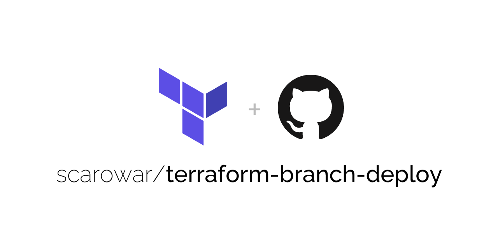

<div align="center">

# Terraform Branch Deploy

<picture>
  <source media="(prefers-color-scheme: dark)" srcset="docs/assets/images/cover-dark.png">
  <source media="(prefers-color-scheme: light)" srcset="docs/assets/images/cover-light.png">
  
</picture>

**Terraform execution for [github/branch-deploy](https://github.com/github/branch-deploy).**

[](https://github.com/scarowar/terraform-branch-deploy/releases)
[](https://github.com/scarowar/terraform-branch-deploy/actions/workflows/ci.yml)
[](https://sonarcloud.io/summary/new_code?id=scarowar_terraform-branch-deploy)
[](https://securityscorecards.dev/viewer/?uri=github.com/scarowar/terraform-branch-deploy)
[](LICENSE)

[Documentation](https://scarowar.github.io/terraform-branch-deploy/) ·
[Quickstart](https://scarowar.github.io/terraform-branch-deploy/quickstart/) ·
[Configuration](https://scarowar.github.io/terraform-branch-deploy/configuration/) ·
[Commands](https://scarowar.github.io/terraform-branch-deploy/reference/commands/)

</div>

---

Terraform Branch Deploy keeps Branch Deploy in charge of the IssueOps workflow: pull request comments, authorization, checks, deployments, locks, and rollback command parsing.

This action adds the Terraform part around that workflow:

- reads Terraform environment configuration from `.tf-branch-deploy.yml`
- runs `terraform init`, `terraform plan`, and `terraform apply`
- saves plan files for normal applies
- writes metadata for new saved plans and verifies it before apply
- posts Terraform plan and apply results back to the pull request

## Workflow

Branch Deploy's model is deploy before merge:

1. Comment `.plan to <env>` on a pull request.
2. Review the Terraform output posted back to the pull request.
3. Comment `.apply to <env>` to apply the saved plan.
4. Merge after the environment has been applied successfully.

For normal applies, the action restores the latest successful saved plan for the same environment and commit SHA. The restored plan artifact name and saved metadata must agree on the plan argument hash before Terraform runs. Rollbacks use Branch Deploy's stable branch command shape:

```text
.apply main to prod
```

## What Branch Deploy Handles

Branch Deploy remains the deployment control plane:

| Area | Handled by |
| --- | --- |
| PR command parsing | Branch Deploy |
| Repository permission checks | Branch Deploy |
| Branch protection, reviews, and CI checks | Branch Deploy |
| GitHub deployment records | Branch Deploy |
| Environment locks | Branch Deploy |
| Terraform configuration and execution | Terraform Branch Deploy |
| Saved plan files and metadata | Terraform Branch Deploy |
| Terraform result comments | Terraform Branch Deploy |

## Quick Start

Start with a Terraform Branch Deploy config:

```yaml
default-environment: dev
production-environments: [prod]

environments:
  dev:
    working-directory: terraform/dev
  prod:
    working-directory: terraform/prod
```

Then add one GitHub Actions job that calls Terraform Branch Deploy in trigger mode, checks out `env.TF_BD_REF` only when `TF_BD_CONTINUE == 'true'`, configures cloud credentials, and calls execute mode. The [Quickstart](https://scarowar.github.io/terraform-branch-deploy/quickstart/) has the complete workflow.

Open a pull request and comment:

```text
.plan to dev
```

After reviewing the plan, apply it:

```text
.apply to dev
```

## Commands

| Command | Purpose |
| --- | --- |
| `.plan to <env>` | Run `terraform plan`, post the result, and save the plan. |
| `.apply to <env>` | Apply the latest successful saved plan for the same environment and commit. |
| `.apply main to <env>` | Roll back by applying the stable branch directly. |
| `.lock <env>` | Lock an environment. |
| `.unlock <env>` | Release a lock. |
| `.wcid` | Show current lock ownership. |

Extra Terraform arguments go after the pipe separator:

```text
.plan to prod | -target=module.database
```

The matching apply remains plain:

```text
.apply to prod
```

Terraform Branch Deploy rejects extra Terraform arguments on apply and rollback.
Those arguments belong on the plan that creates the saved plan file. Rollback
applies the stable branch directly; Terraform does not provide a deterministic
target-only undo operation.

If you run another successful plan for the same environment and commit, that
newer plan is the one a later `.apply to <env>` uses.

## Documentation

| Resource | Use it for |
| --- | --- |
| [Quickstart](https://scarowar.github.io/terraform-branch-deploy/quickstart/) | First working workflow. |
| [Upgrading](https://scarowar.github.io/terraform-branch-deploy/upgrading/) | Changes to review before moving between releases. |
| [Changelog](CHANGELOG.md) | Versioned release history. |
| [How It Works](https://scarowar.github.io/terraform-branch-deploy/concepts/modes/) | How the two action modes fit in one job. |
| [Configuration](https://scarowar.github.io/terraform-branch-deploy/configuration/) | Environment and Terraform settings. |
| [Commands](https://scarowar.github.io/terraform-branch-deploy/reference/commands/) | PR comment command reference. |
| [Security](https://scarowar.github.io/terraform-branch-deploy/security/) | Branch Deploy controls and saved plan behavior. |
| [Troubleshooting](https://scarowar.github.io/terraform-branch-deploy/troubleshooting/) | Common setup issues and fixes. |

## Contributing

See [CONTRIBUTING.md](CONTRIBUTING.md), [SECURITY.md](SECURITY.md), and [CODE_OF_CONDUCT.md](CODE_OF_CONDUCT.md).

## License

[MIT](LICENSE)
