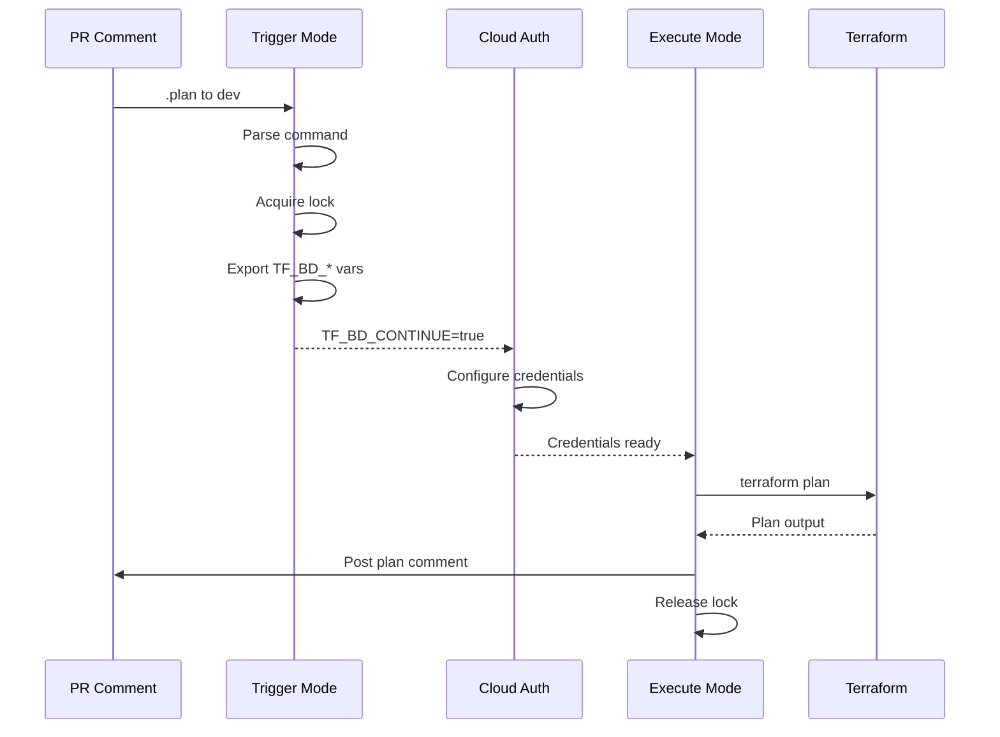

# Trigger and Execute

Terraform Branch Deploy uses a **two-mode architecture**: **trigger** and **execute**.



---

## Overview

| Mode | Purpose |
|------|---------|
| `trigger` | Parse PR comment, export `TF_BD_*` env vars |
| `execute` | Run terraform, complete lifecycle |

This split enables credential injection between the two action invocations.

---

## Trigger Mode

Parses the deployment command and exports context to environment variables.

```yaml
- uses: scarowar/terraform-branch-deploy@v0.2.0
  with:
    mode: trigger
    github-token: ${{ secrets.GITHUB_TOKEN }}
```

After trigger mode, these variables are available:

| Variable | Description |
|----------|-------------|
| `TF_BD_CONTINUE` | Whether to continue with execution |
| `TF_BD_ENVIRONMENT` | Target environment |
| `TF_BD_OPERATION` | `plan`, `apply`, or `rollback` |
| `TF_BD_IS_ROLLBACK` | Whether this is a rollback |
| `TF_BD_REF` | Git ref to checkout |
| `TF_BD_SHA` | Commit SHA |

See [Environment Variables](../reference/environment-vars.md) for the full list.

---

## Execute Mode

Runs terraform and completes the deployment lifecycle.

```yaml
- uses: scarowar/terraform-branch-deploy@v0.2.0
  if: env.TF_BD_CONTINUE == 'true'
  with:
    mode: execute
    github-token: ${{ secrets.GITHUB_TOKEN }}
```

Execute mode reads from `TF_BD_*` environment variables set by trigger mode.

---

## Complete Workflow

```yaml
jobs:
  deploy:
    if: github.event.issue.pull_request
    runs-on: ubuntu-latest
    steps:
      # Checkout to read config
      - uses: actions/checkout@v4

      # Parse command, acquire lock
      - uses: scarowar/terraform-branch-deploy@v0.2.0
        with:
          mode: trigger
          github-token: ${{ secrets.GITHUB_TOKEN }}

      # Checkout PR branch
      - uses: actions/checkout@v4
        if: env.TF_BD_CONTINUE == 'true'
        with:
          ref: ${{ env.TF_BD_REF }}

      # Optional: Configure credentials
      - uses: aws-actions/configure-aws-credentials@v4
        if: env.TF_BD_CONTINUE == 'true'
        with:
          role-to-assume: arn:aws:iam::123456789:role/deploy
          aws-region: us-east-1

      # Run terraform
      - uses: scarowar/terraform-branch-deploy@v0.2.0
        if: env.TF_BD_CONTINUE == 'true'
        with:
          mode: execute
          github-token: ${{ secrets.GITHUB_TOKEN }}
```

!!! note "Single Job"
    All steps run in one job. Environment variables from trigger mode are available to subsequent steps automatically.

## Lifecycle Completion

Execute mode automatically handles:

1. Updates deployment status (success/failure)
2. Removes initial 👀 reaction
3. Adds result reaction (🚀 success, 👎 failure)
4. Posts deployment result comment
5. Removes non-sticky locks

## Comparison

| Aspect | Trigger | Execute |
|--------|---------|---------|
| Comment parsing | ✅ Yes | ❌ No |
| Env var export | ✅ Yes | ❌ No |
| Terraform execution | ❌ No | ✅ Yes |
| Lifecycle completion | ❌ No | ✅ Yes |
