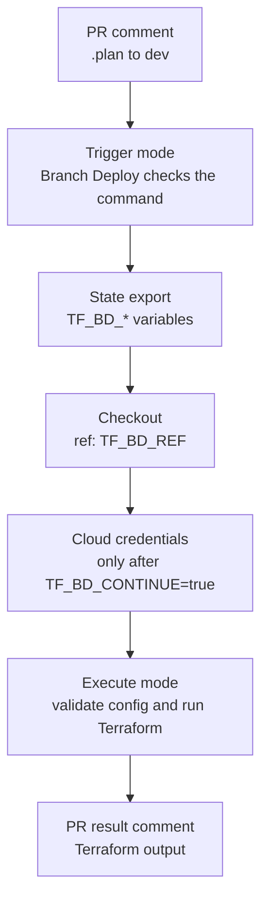

# How It Works

Terraform Branch Deploy is called twice in one job:

| Mode | Job |
| --- | --- |
| `trigger` | Run Branch Deploy, decide whether the command should continue, and export `TF_BD_*` variables. |
| `execute` | Read `TF_BD_*`, validate the target environment, run Terraform, and complete the Branch Deploy lifecycle. |

The split gives the workflow a place to configure cloud credentials after the PR comment has been authorized and before Terraform runs.

## Branch Deploy Foundation

Branch Deploy owns the deployment control plane. It decides whether a pull request comment is a valid command, whether the actor may run it, whether checks and reviews are satisfied, whether an environment is locked, and which ref should be deployed.

Terraform Branch Deploy runs only after that decision. It uses the exported Branch Deploy state to select the Terraform environment, run the Terraform command, and complete the deployment lifecycle.

## Flow


```mermaid
flowchart TD
    Comment["PR comment<br/>.plan to dev"]
    Trigger["Trigger mode<br/>Branch Deploy checks the command"]
    State["State export<br/>TF_BD_* variables"]
    Checkout["Checkout<br/>ref: TF_BD_REF"]
    Auth["Cloud credentials<br/>only after TF_BD_CONTINUE=true"]
    Execute["Execute mode<br/>validate config and run Terraform"]
    Result["PR result comment<br/>Terraform output"]

    Comment --> Trigger --> State --> Checkout --> Auth --> Execute --> Result
```

## Trigger Mode

Use trigger mode before checkout of the target ref and before cloud credentials:

```yaml
- uses: scarowar/terraform-branch-deploy@<terraform-branch-deploy-ref>
  with:
    mode: trigger
    github-token: ${{ secrets.GITHUB_TOKEN }}
    disable-naked-commands: true
    checks: all
    outdated-mode: strict
```

Trigger mode calls `github/branch-deploy`. It does not run Terraform.

Important variables include:

| Variable | Meaning |
| --- | --- |
| `TF_BD_CONTINUE` | Whether later steps should run. |
| `TF_BD_ENVIRONMENT` | Target environment. |
| `TF_BD_OPERATION` | `plan`, `apply`, or `rollback`. |
| `TF_BD_REF` | Ref to check out before running Terraform. |
| `TF_BD_SHA` | Commit SHA associated with the command. |
| `TF_BD_PARAMS` | Extra arguments after the command separator. |

See [Environment Variables](../reference/environment-vars.md) for the complete list.

## Execute Mode

Use execute mode after checking out `TF_BD_REF` and configuring credentials:

```yaml
- uses: scarowar/terraform-branch-deploy@<terraform-branch-deploy-ref>
  if: env.TF_BD_CONTINUE == 'true'
  with:
    mode: execute
    github-token: ${{ secrets.GITHUB_TOKEN }}
```

Execute mode validates the exported state, checks the requested environment against `.tf-branch-deploy.yml`, runs Terraform, posts the Terraform result, and completes the Branch Deploy lifecycle.

For normal applies, execute mode restores a saved plan for the target environment and commit. For rollbacks, it applies the stable branch directly.

## Complete Job

```yaml
jobs:
  deploy:
    if: github.event.issue.pull_request
    runs-on: ubuntu-latest
    steps:
      - uses: actions/checkout@v6

      - uses: scarowar/terraform-branch-deploy@<terraform-branch-deploy-ref>
        with:
          mode: trigger
          github-token: ${{ secrets.GITHUB_TOKEN }}
          disable-naked-commands: true
          checks: all
          outdated-mode: strict

      - uses: actions/checkout@v6
        if: env.TF_BD_CONTINUE == 'true'
        with:
          ref: ${{ env.TF_BD_REF }}

      - uses: aws-actions/configure-aws-credentials@v5
        if: env.TF_BD_CONTINUE == 'true'
        with:
          role-to-assume: arn:aws:iam::123456789012:role/terraform
          aws-region: us-east-1

      - uses: scarowar/terraform-branch-deploy@<terraform-branch-deploy-ref>
        if: env.TF_BD_CONTINUE == 'true'
        with:
          mode: execute
          github-token: ${{ secrets.GITHUB_TOKEN }}
```

## Rules

- Keep both modes in one job. `GITHUB_ENV` variables do not cross job boundaries.
- Gate every step after trigger mode with `if: env.TF_BD_CONTINUE == 'true'`.
- Check out `env.TF_BD_REF` before execute mode.
- Put cloud credentials between the second checkout and execute mode.
- Do not call execute mode directly; it requires state exported by trigger mode.

## Lifecycle Completion

Execute mode finishes the Branch Deploy command after Terraform exits:

1. Updates the GitHub deployment status.
2. Removes the initial reaction.
3. Posts the Terraform result comment.
4. Releases non-sticky locks.
5. Marks the command success or failure for Branch Deploy.
