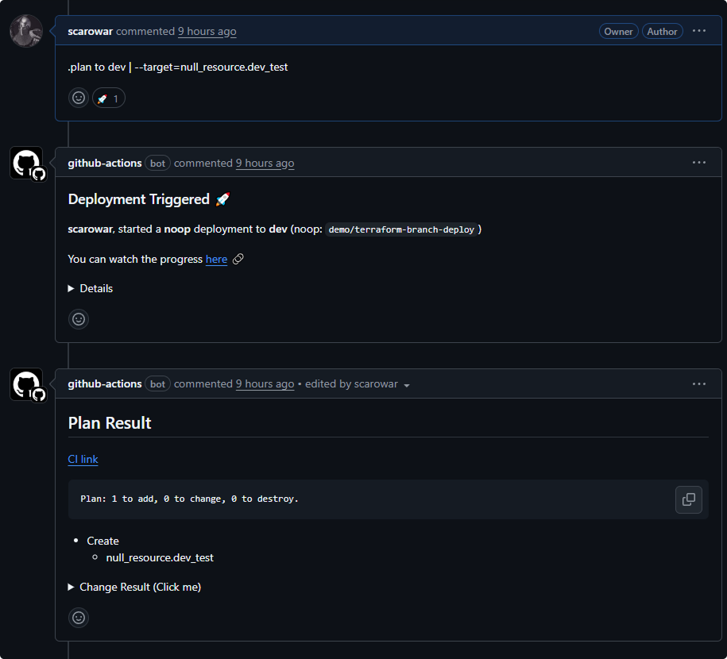

# Examples

## Basic Setup

The minimal workflow to get started:

```yaml title=".github/workflows/deploy.yml"
name: Terraform Deploy

on:
  issue_comment:
    types: [created]

permissions:
  contents: write
  pull-requests: write
  deployments: write

jobs:
  deploy:
    if: github.event.issue.pull_request
    runs-on: ubuntu-latest
    steps:
      - uses: actions/checkout@v4

      - uses: scarowar/terraform-branch-deploy@v0.2.0
        with:
          github-token: ${{ secrets.GITHUB_TOKEN }}
```

---

## Environment-Based Credential Injection

### AWS with Environment Routing

```yaml
- uses: aws-actions/configure-aws-credentials@v4
  if: env.TF_BD_CONTINUE == 'true'
  with:
    role-to-assume: arn:aws:iam::${{ env.TF_BD_ENVIRONMENT == 'prod' && '111111111' || '222222222' }}:role/terraform
    aws-region: us-east-1
```

### GCP with Per-Environment Workload Identity

```yaml
- uses: google-github-actions/auth@v2
  if: env.TF_BD_CONTINUE == 'true'
  with:
    workload_identity_provider: projects/${{ env.TF_BD_ENVIRONMENT == 'prod' && 'prod-project' || 'dev-project' }}/locations/global/workloadIdentityPools/github/providers/github
    service_account: terraform@${{ env.TF_BD_ENVIRONMENT }}-project.iam.gserviceaccount.com
```

### Azure with Environment-Specific Credentials

```yaml
- uses: azure/login@v2
  if: env.TF_BD_CONTINUE == 'true'
  with:
    client-id: ${{ secrets[format('{0}_AZURE_CLIENT_ID', env.TF_BD_ENVIRONMENT)] }}
    tenant-id: ${{ secrets.AZURE_TENANT_ID }}
    subscription-id: ${{ secrets[format('{0}_AZURE_SUBSCRIPTION_ID', env.TF_BD_ENVIRONMENT)] }}
```

---

## Execute Mode with Policy Check

Use execute mode when you need custom logic between command parsing and Terraform execution:

```yaml title=".github/workflows/deploy.yml"
name: Terraform Deploy with Policy

on:
  issue_comment:
    types: [created]

permissions:
  contents: write
  pull-requests: write
  deployments: write

jobs:
  parse:
    if: github.event.issue.pull_request
    runs-on: ubuntu-latest
    outputs:
      continue: ${{ steps.branch-deploy.outputs.continue }}
      environment: ${{ steps.branch-deploy.outputs.environment }}
      sha: ${{ steps.branch-deploy.outputs.sha }}
      noop: ${{ steps.branch-deploy.outputs.noop }}
    steps:
      - uses: github/branch-deploy@v11
        id: branch-deploy
        with:
          github_token: ${{ secrets.GITHUB_TOKEN }}

  policy:
    needs: parse
    if: needs.parse.outputs.continue == 'true'
    runs-on: ubuntu-latest
    steps:
      - uses: actions/checkout@v4

      - name: Run Policy Check
        run: ./scripts/policy-check.sh

  deploy:
    needs: [parse, policy]
    runs-on: ubuntu-latest
    steps:
      - uses: actions/checkout@v4

      - uses: scarowar/terraform-branch-deploy@v0.2.0
        with:
          mode: execute
          github-token: ${{ secrets.GITHUB_TOKEN }}
          environment: ${{ needs.parse.outputs.environment }}
          sha: ${{ needs.parse.outputs.sha }}
          operation: ${{ needs.parse.outputs.noop == 'true' && 'plan' || 'apply' }}
```

---

## Monorepo Setup

For repositories with multiple Terraform configurations:

```yaml title=".tf-branch-deploy.yml"
default-environment: api-dev
production-environments: [api-prod, web-prod]

environments:
  # API service
  api-dev:
    working-directory: services/api/terraform/dev
  api-prod:
    working-directory: services/api/terraform/prod

  # Web service
  web-dev:
    working-directory: services/web/terraform/dev
  web-prod:
    working-directory: services/web/terraform/prod
```

Deploy with:

```
.plan to api-dev
.apply to web-prod
```

---

## Unlock on Merge

Automatically release locks when PRs are merged:

```yaml title=".github/workflows/unlock-on-merge.yml"
name: Unlock on Merge

on:
  pull_request:
    types: [closed]

permissions:
  contents: write

jobs:
  unlock:
    if: github.event.pull_request.merged == true
    runs-on: ubuntu-latest
    steps:
      - uses: scarowar/terraform-branch-deploy@v0.2.0
        with:
          github-token: ${{ secrets.GITHUB_TOKEN }}
          unlock-on-merge-mode: true
```

---

## Enterprise Guardrails

Complete example with security features enabled:

```yaml title=".github/workflows/deploy.yml"
name: Terraform Deploy

on:
  issue_comment:
    types: [created]

permissions:
  contents: write
  pull-requests: write
  deployments: write
  checks: read

jobs:
  deploy:
    if: github.event.issue.pull_request
    runs-on: ubuntu-latest
    steps:
      - uses: actions/checkout@v4

      - uses: scarowar/terraform-branch-deploy@v0.2.0
        with:
          github-token: ${{ secrets.GITHUB_TOKEN }}

          # Access Control
          admins: "my-org/platform-team"
          admins-pat: ${{ secrets.ADMIN_PAT }}

          # CI Requirements
          checks: all

          # Branch Protection
          outdated-mode: strict
          allow-forks: false

          # Deployment Safety
          disable-naked-commands: true
          enforced-deployment-order: "dev,staging,prod"
          sticky-locks: true

          # Production Safety
          deployment-confirmation: true
```

---

## Terraform Version Pinning

Pin to a specific Terraform version:

```yaml
- uses: scarowar/terraform-branch-deploy@v0.2.0
  with:
    github-token: ${{ secrets.GITHUB_TOKEN }}
    terraform-version: "1.7.0"
```

---

## Dynamic Arguments

Pass additional arguments to Terraform via PR comments:

```text
.plan to dev | -target=module.api -refresh=false
```



These arguments are appended to the `terraform plan` command.

```text
.apply to dev | -parallelism=1
```

For apply, arguments are appended to `terraform apply`.

!!! warning "Security"
    Dynamic arguments are sanitized but review them in the plan output before applying.
