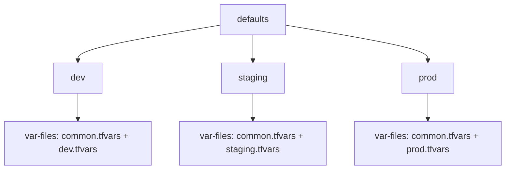

# Configuration

The `.tf-branch-deploy.yml` file defines your environments and Terraform settings.

## Minimal Config

```yaml title=".tf-branch-deploy.yml"
default-environment: dev
production-environments: [prod]

environments:
  dev:
    working-directory: terraform/dev
  prod:
    working-directory: terraform/prod
```

## Full Config

```yaml title=".tf-branch-deploy.yml"
default-environment: dev
production-environments: [prod]
stable-branch: main

defaults:
  var-files:
    paths:
      - ../common.tfvars
  plan-args:
    args:
      - "-parallelism=20"

environments:
  dev:
    working-directory: terraform/dev
    var-files:
      inherit: true
      paths:
        - dev.tfvars

  staging:
    working-directory: terraform/staging
    var-files:
      inherit: true
      paths:
        - staging.tfvars

  prod:
    working-directory: terraform/prod
    var-files:
      inherit: true
      paths:
        - prod.tfvars
    plan-args:
      args:
        - "-parallelism=10"
```

## Root-Level Fields

| Field | Required | Default | Description |
|-------|----------|---------|-------------|
| `default-environment` | Yes | - | Environment used when none specified |
| `production-environments` | Yes | - | List of production environments |
| `stable-branch` | No | `main` | Branch for rollbacks |
| `environments` | Yes | - | Environment definitions |
| `defaults` | No | - | Shared settings inherited by all environments |

## Environment Fields

| Field | Description |
|-------|-------------|
| `working-directory` | Path to Terraform root module (required) |
| `var-files` | Variable files to pass to Terraform |
| `backend-configs` | Backend configuration values for `terraform init -backend-config` |
| `plan-args` | Additional arguments for `terraform plan` |
| `apply-args` | Additional arguments for `terraform apply` |
| `init-args` | Additional arguments for `terraform init` |

## Inheritance

By default, environments inherit from `defaults`. This creates a layered configuration:



### Disable Inheritance

Override inheritance for specific fields:

```yaml
prod:
  var-files:
    inherit: false  # Don't inherit from defaults
    paths:
      - prod-only.tfvars
```

### Merge Behavior

When `inherit: true` (default):

- **var-files**: Merged (defaults + environment)
- **args**: Merged (defaults + environment)
- **backend-configs**: Merged (defaults + environment)

When `inherit: false`:

- Only environment-specific values are used

## Variable Files Format

```yaml
var-files:
  inherit: true  # Optional, default: true
  paths:
    - variables.tfvars
    - ../shared/common.tfvars
```

Paths are relative to the environment's `working-directory`.

## Backend Configs Format

```yaml
backend-configs:
  inherit: true
  values:
    bucket: "my-tf-state"
    key: "dev/terraform.tfstate"
    region: "us-east-1"
```

These are passed as `-backend-config=key=value` to `terraform init`.

## Arguments Format

```yaml
plan-args:
  inherit: true
  args:
    - "-parallelism=20"
    - "-refresh=false"

apply-args:
  args:
    - "-parallelism=10"

init-args:
  args:
    - "-upgrade"
```

## Complete Example

```yaml title=".tf-branch-deploy.yml"
# yaml-language-server: $schema=https://raw.githubusercontent.com/scarowar/terraform-branch-deploy/main/tf-branch-deploy.schema.json

default-environment: dev
production-environments: [prod, prod-eu]
stable-branch: main

defaults:
  var-files:
    paths:
      - ../common/variables.tfvars
  init-args:
    args:
      - "-upgrade"
  plan-args:
    args:
      - "-parallelism=20"

environments:
  dev:
    working-directory: terraform/environments/dev
    var-files:
      inherit: true
      paths:
        - dev.tfvars
    backend-configs:
      values:
        key: "dev/terraform.tfstate"

  staging:
    working-directory: terraform/environments/staging
    var-files:
      inherit: true
      paths:
        - staging.tfvars
    backend-configs:
      values:
        key: "staging/terraform.tfstate"

  prod:
    working-directory: terraform/environments/prod
    var-files:
      inherit: true
      paths:
        - prod.tfvars
    backend-configs:
      values:
        key: "prod/terraform.tfstate"
    plan-args:
      inherit: false
      args:
        - "-parallelism=10"

  prod-eu:
    working-directory: terraform/environments/prod-eu
    var-files:
      inherit: true
      paths:
        - prod-eu.tfvars
    backend-configs:
      values:
        key: "prod-eu/terraform.tfstate"
```

## Schema Validation

Enable IDE validation with the JSON schema:

=== "VS Code"

    Add to the top of your config file:

    ```yaml
    # yaml-language-server: $schema=https://raw.githubusercontent.com/scarowar/terraform-branch-deploy/main/tf-branch-deploy.schema.json
    ```

=== "JetBrains IDEs"

    1. Open Settings → Languages & Frameworks → Schemas and DTDs → JSON Schema Mappings
    2. Add new mapping:
       - Name: `terraform-branch-deploy`
       - Schema URL: `https://raw.githubusercontent.com/scarowar/terraform-branch-deploy/main/tf-branch-deploy.schema.json`
       - File pattern: `.tf-branch-deploy.yml`
