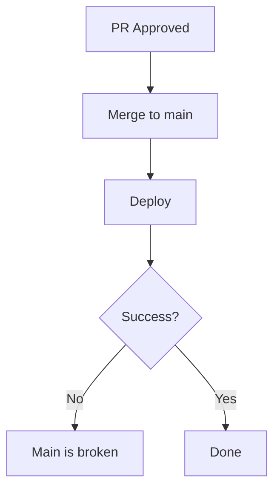
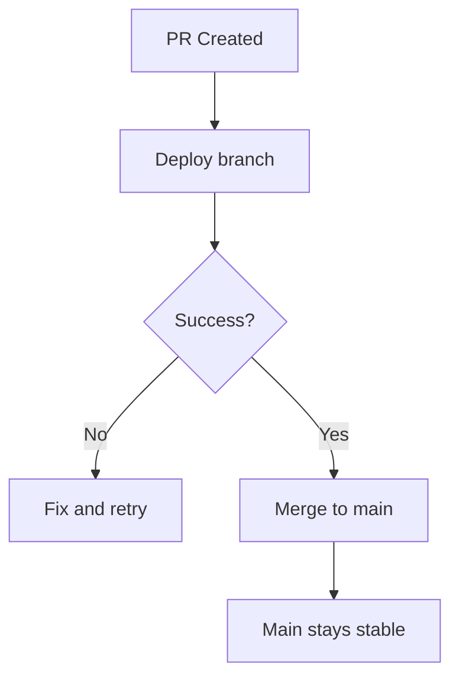

# Terraform Branch Deploy


Terraform integrated into the [Branch Deploy](https://github.com/github/branch-deploy) operating model.

---

## The Problem

Traditional CI/CD deploys after merging. If deployment fails, main is broken.



## The Solution

Branch Deploy inverts this: deploy from the PR branch first, then merge only if successful.



Terraform Branch Deploy applies this model to infrastructure:

1. **Plan** from your pull request
2. **Review** the changes
3. **Apply** that exact plan

The plan is cached and checksummed. What you review is what gets applied.

---

## Commands

| Command | Effect |
|---------|--------|
| `.plan to <env>` | Preview infrastructure changes |
| `.apply to <env>` | Apply the reviewed plan |
| `.apply main to <env>` | Rollback to stable main branch |
| `.lock <env>` | Acquire environment lock |
| `.unlock <env>` | Release lock |

Pass extra arguments with a pipe: `.plan to prod | -target=module.database`

---

## Quick Start

Create `.tf-branch-deploy.yml`:

```yaml
default-environment: dev
production-environments: [prod]

environments:
  dev:
    working-directory: terraform/dev
  prod:
    working-directory: terraform/prod
```

Create `.github/workflows/deploy.yml`:

```yaml
name: Deploy
on:
  issue_comment:
    types: [created]

permissions:
  contents: write
  pull-requests: write
  deployments: write

jobs:
  deploy:
    if: github.event.issue.pull_request
    runs-on: ubuntu-latest
    steps:
      - uses: actions/checkout@v4

      - uses: scarowar/terraform-branch-deploy@v0
        with:
          mode: trigger
          github-token: ${{ secrets.GITHUB_TOKEN }}

      - uses: actions/checkout@v4
        if: env.TF_BD_CONTINUE == 'true'
        with:
          ref: ${{ env.TF_BD_REF }}

      - uses: scarowar/terraform-branch-deploy@v0
        if: env.TF_BD_CONTINUE == 'true'
        with:
          mode: execute
          github-token: ${{ secrets.GITHUB_TOKEN }}
```

Comment on a PR: `.plan to dev`

---

## Documentation

- [Quickstart](quickstart.md) — First deployment in 5 minutes
- [Trigger and Execute](concepts/modes.md) — How the two-mode architecture works
- [Configuration](configuration/index.md) — Environment setup and inheritance
- [Commands](reference/commands.md) — All PR comment commands
- [Inputs](reference/inputs.md) — Workflow configuration
- [Security](security.md) — Access control and guardrails
- [Troubleshooting](troubleshooting.md) — Common issues
