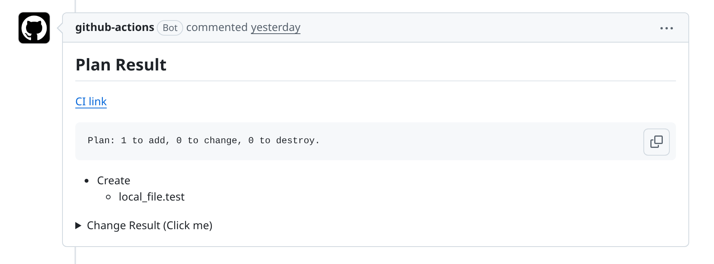
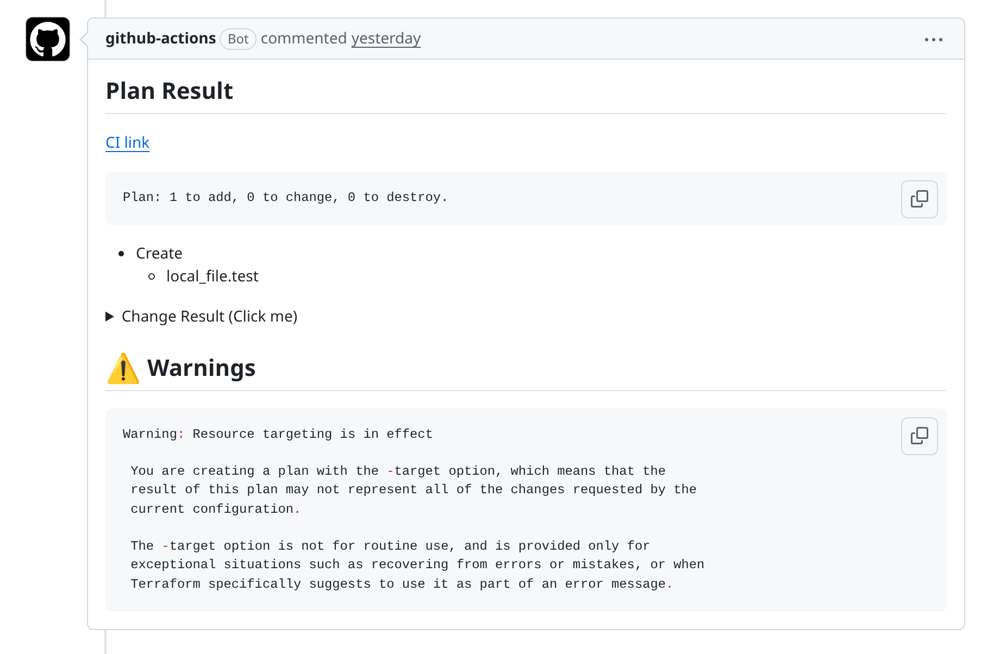
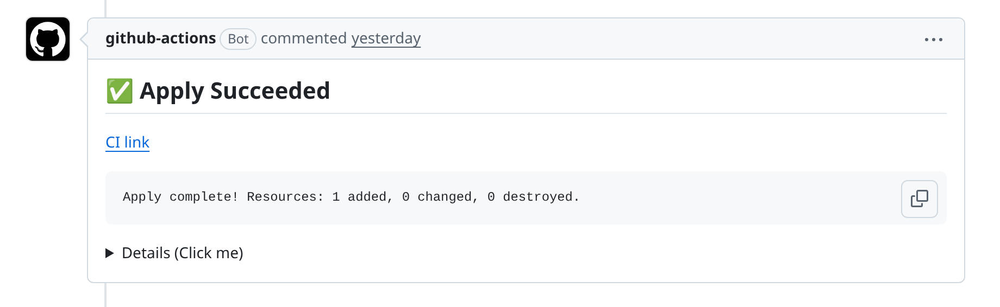

# Terraform Branch Deploy


Terraform Branch Deploy is a GitHub Action that adds Terraform plan/apply execution to [github/branch-deploy](https://github.com/github/branch-deploy).

Branch Deploy handles the IssueOps workflow: pull request comments, authorization, checks, deployments, locks, and rollback command parsing. Terraform Branch Deploy supplies the Terraform execution layer around that workflow.

## Why It Exists

Branch Deploy moves deployment before merge. A pull request branch can be deployed, checked, and fixed before it reaches the stable branch. If something goes wrong, the rollback path is to deploy the stable branch again.

Terraform Branch Deploy brings that model to Terraform:

- plan from a pull request
- review the Terraform output in the pull request
- apply the saved plan after review
- keep the stable branch as the rollback source

## Branch Deploy Principles

| Principle | What it means for Terraform |
| --- | --- |
| Pull request comments are the control surface. | Operators use `.plan`, `.apply`, `.lock`, `.unlock`, `.wcid`, and `.help` on the pull request. |
| The stable branch should remain deployable. | Deploy the pull request first, then merge after the environment is known good. |
| Rollback means deploying the stable branch. | `.apply main to prod` applies the stable branch directly. |
| Repository policy decides who can deploy. | Branch Deploy checks actor permissions, reviews, CI checks, branch state, and deployment order. |
| Locks prevent competing deployments. | Use environment or global locks while maintenance, incidents, or validation are in progress. |

## What Each Layer Does

| Layer | Responsibility |
| --- | --- |
| Branch Deploy | Command parsing, authorization, checks, deployments, locks, stable branch rollback commands, and lifecycle state. |
| Terraform Branch Deploy | Environment config, Terraform init/plan/apply, saved plans, saved plan metadata, and Terraform result comments. |
| Pull request | The review surface for commands, plan output, apply output, deployment status, and operator discussion. |

## Workflow

| Step | Comment | Result |
| --- | --- | --- |
| Plan | `.plan to dev` | Runs `terraform plan`, posts the result, and saves the plan for the commit and environment. |
| Review | Read the plan comment | Review additions, changes, destroys, and warnings before applying. |
| Apply | `.apply to dev` | Restores and applies the saved plan. |
| Roll back | `.apply main to prod` | Applies the stable branch directly. |

A normal pull request workflow stays inside GitHub:

**1. Request a plan**


**2. Review the plan summary**



**3. Expand the Terraform diff**


**4. Apply after review**


**5. Confirm apply succeeded**


For targeted plans, keep apply simple:

```text
.plan to prod | -target=module.database
.apply to prod
```

The apply step uses the saved targeted plan. It does not create a new untargeted apply, and extra Terraform arguments are rejected on apply.

**Targeted plans keep their Terraform arguments in the saved plan**



**Normal apply uses that saved targeted plan**



## Start Building

The first workflow needs three pieces:

- `.tf-branch-deploy.yml` with the environments that can be targeted from pull request comments.
- One GitHub Actions job that runs trigger mode, checks out `env.TF_BD_REF` only after `TF_BD_CONTINUE == 'true'`, configures credentials, and runs execute mode.
- Pull request comments for plan, review, apply, locks, and rollback.

The [Quickstart](quickstart.md) has the complete copy-paste workflow, including cloud credential placement.

Then comment on a pull request:

```text
.plan to dev
```

## Command Summary

| Command | Purpose |
| --- | --- |
| `.plan to <env>` | Run `terraform plan`, post the result, and save the plan. |
| `.apply to <env>` | Apply the saved plan for the same environment and commit. |
| `.apply main to <env>` | Roll back by applying the stable branch directly. |
| `.lock <env>` | Lock an environment. |
| `.unlock <env>` | Release a lock. |
| `.wcid` | Show current lock ownership. |

Extra Terraform arguments go after the pipe separator:

```text
.plan to prod | -target=module.database
```

The matching apply remains plain. Rollback remains the stable-branch apply path;
Terraform Branch Deploy does not offer target-only rollback because Terraform
does not provide a deterministic inverse for a targeted apply.

## Next

- [Quickstart](quickstart.md): build the first workflow.
- [How It Works](concepts/modes.md): understand the two action modes.
- [Configuration](configuration/index.md): define environments and Terraform settings.
- [Commands](reference/commands.md): use the PR comment interface.
- [Security](security.md): review Branch Deploy controls and saved plan behavior.
- [Troubleshooting](troubleshooting.md): fix common setup issues.
