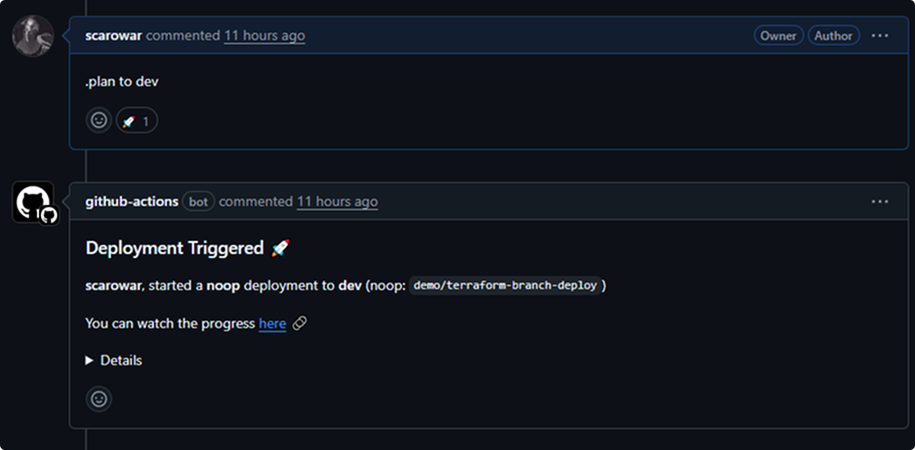

# Terraform Branch Deploy


ChatOps for Terraform infrastructure deployments via GitHub PRs.

## Usage

```yaml
- uses: scarowar/terraform-branch-deploy@v0.2.0
  with:
    github-token: ${{ secrets.GITHUB_TOKEN }}
```

## Features

| Feature | Description |
|---------|-------------|
| **PR-driven** | Trigger deployments from PR comments with `.plan` and `.apply` |
| **Multi-environment** | Define dev, staging, prod with per-environment configuration |
| **Plan safety** | Requires `.plan` before `.apply` with SHA verification |
| **Environment locking** | Prevents concurrent deployments to the same environment |
| **Dynamic args** | Pass terraform arguments: `.plan to dev \| -target=module.api` |
| **Pre-terraform hooks** | Build lambdas, fetch secrets, run migrations before TF |
| **GHES compatible** | Works with GitHub Enterprise Server |

## Commands

| Command | Description |
|---------|-------------|
| `.plan to dev` | Preview changes |
| `.apply to dev` | Deploy changes |
| `.lock dev` | Lock environment |
| `.unlock dev` | Unlock environment |
| `.wcid` | Who's deploying? |
| `.apply main to prod` | Rollback to main |

## PR Comment Examples

=== "Plan"

    

    

=== "Apply"

    

    

=== "Locking"

    

    

    

## Inputs

| Input | Required | Description |
|-------|----------|-------------|
| `github-token` | Yes | GitHub token with PR write access |
| `mode` | No | `dispatch` (default) or `execute` |
| `config-path` | No | Path to `.tf-branch-deploy.yml` |
| `pre-terraform-hook` | No | Shell commands before TF runs |

[View all inputs →](reference/inputs.md)

## Outputs

| Output | Description |
|--------|-------------|
| `working-directory` | Resolved working directory |
| `is-production` | Whether target is production |
| `has-changes` | Whether plan detected changes |
| `plan-checksum` | SHA256 of plan file |

## Documentation

| Page | Description |
|------|-------------|
| [Getting Started](getting-started/index.md) | First deployment in 5 minutes |
| [Configuration](guides/configuration.md) | `.tf-branch-deploy.yml` reference |
| [Modes](guides/modes.md) | Dispatch vs Execute |
| [Pre-Terraform Hooks](guides/hooks.md) | Custom pre-deploy logic |
| [Guardrails & Security](guides/guardrails.md) | Enterprise governance features |
| [Reference](reference/inputs.md) | All inputs & outputs |
| [Examples](examples/index.md) | Workflow snippets |
| [Troubleshooting](troubleshooting.md) | Common issues |
