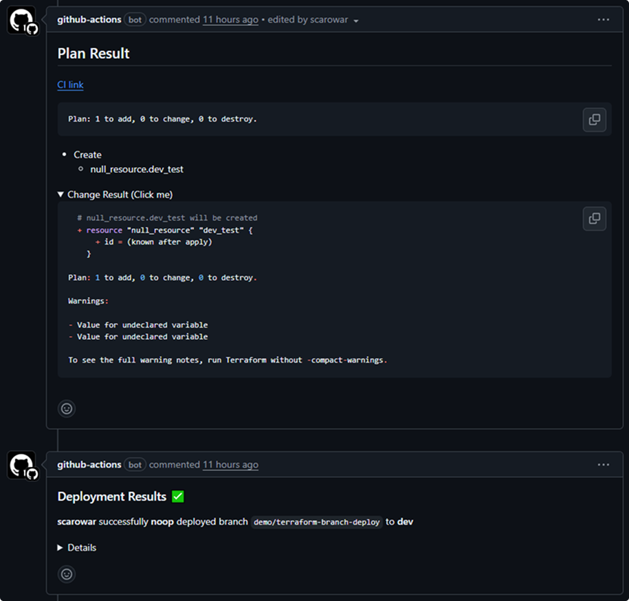
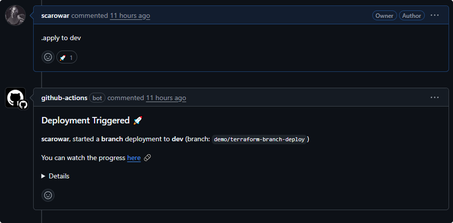
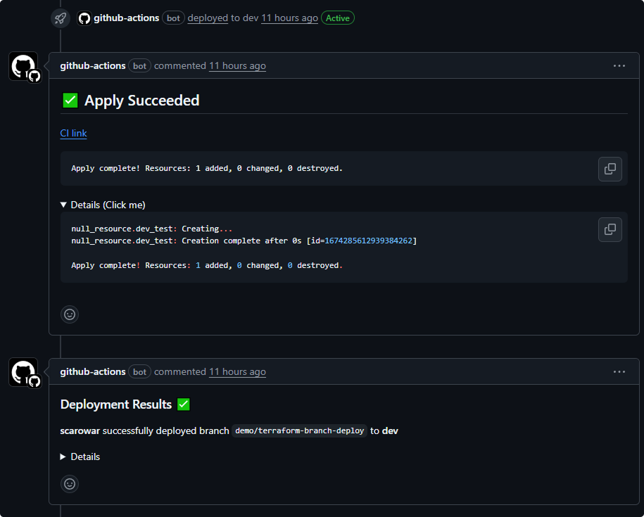

# Terraform Branch Deploy

## Overview

Terraform Branch Deploy extends [branch-deploy](https://github.com/github/branch-deploy) with first-class support for Terraform infrastructure automation.

## Key Features

- **PR-driven automation**: Trigger `plan` and `apply` by commenting on pull requests.
- **Environment targeting**: Define environments (dev, staging, prod, etc.) in `.tf-branch-deploy.yml` with per-environment config, var files, and working directories.
- **Safe deployments**: Preview every change with a Terraform plan before apply, and support instant rollbacks to a stable branch.
- **Environment locking**: Prevent concurrent or conflicting deployments with automatic and manual environment locks.
- **Custom arguments**: Pass extra Terraform CLI arguments from PR comments and fine-tune behavior per environment or globally via `.tf-branch-deploy.yml`.
- **Enterprise ready**: Works with GitHub Enterprise Server (GHES) and public GitHub, with automated GHES release tagging.
- **Workflow integration**: Use the `skip` input to extract environment context for advanced, multi-step workflows without running Terraform operations.

## Workflow Example

See how easy it is to preview and deploy changes with Terraform Branch Deploy:

=== "1. Trigger `plan` command"
	
    /// caption
	Comment `.plan to dev` on a pull request to start a Terraform plan for the `dev` environment.
    ///
=== "2. Review `plan` output"
	
    /// caption
	The plan output is posted back to the pull request for review and approval.
    ///
=== "3. Trigger `apply` command"
	
    /// caption
	After review, comment `.apply to dev` to initiate the deployment to the `dev` environment.
    ///
=== "4. Review `apply` output"
	
    /// caption
	The apply output is posted back to the pull request, confirming the deployment results.
    ///

## Need Help?

- **Questions?** Start a [discussion](https://github.com/scarowar/terraform-branch-deploy/discussions)
- **Found a bug?** Open an [issue](https://github.com/scarowar/terraform-branch-deploy/issues)
- **Security concern?** See our [security policy](https://github.com/scarowar/terraform-branch-deploy/blob/main/SECURITY.md)

## Contributing

We'd love your help making Terraform Branch Deploy even better! Check out our [contributing guide](https://github.com/scarowar/terraform-branch-deploy/blob/main/CONTRIBUTING.md) to get started.

## License

MIT License - see [LICENSE](https://github.com/scarowar/terraform-branch-deploy/blob/main/LICENSE) for details.

---

Made with  :heart:{ .heart }  in Mysuru, India
