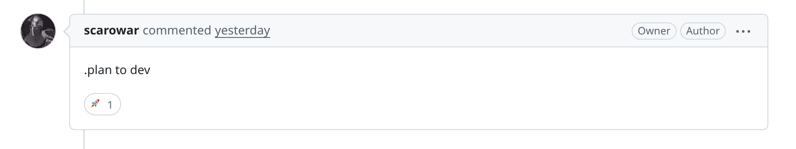
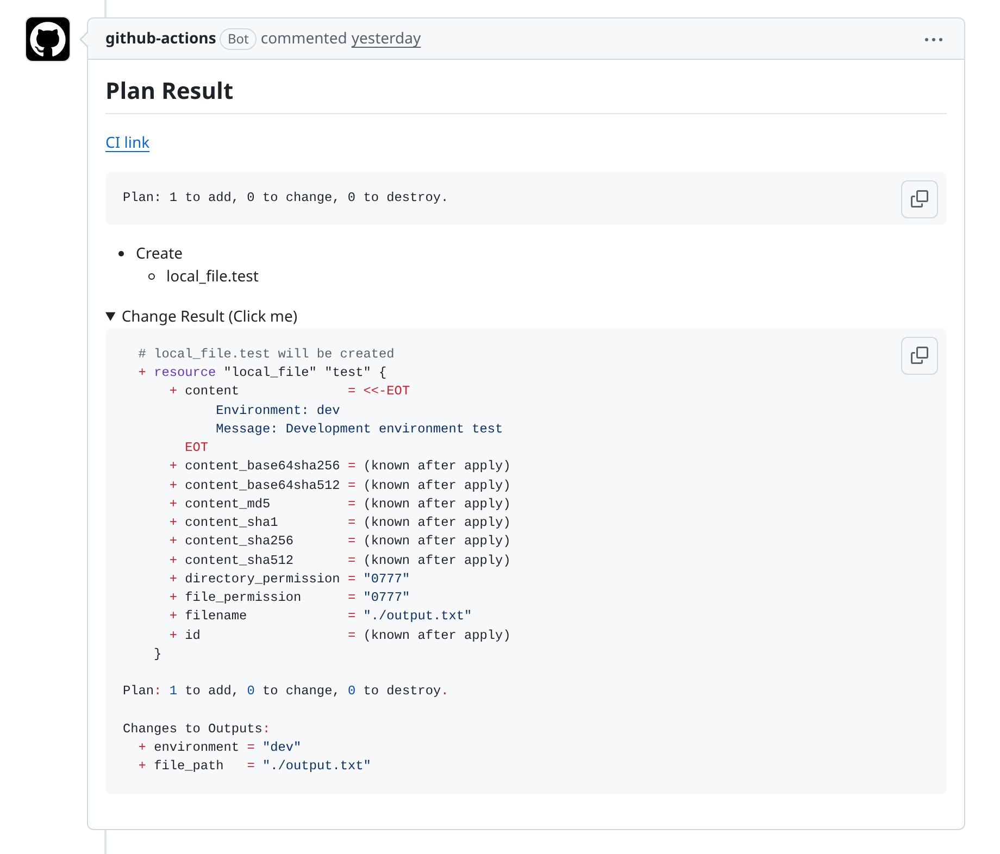
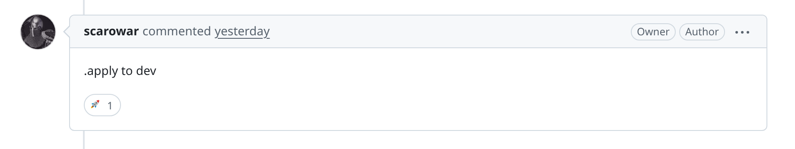
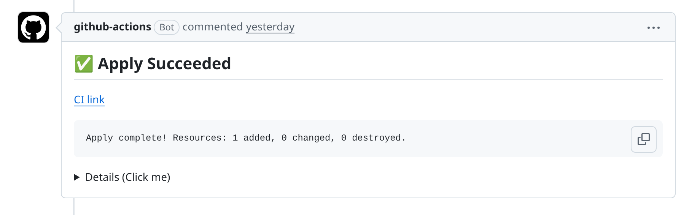

# Quickstart

This guide creates a pull-request driven Terraform workflow with one non-production environment and one production environment.

The workflow uses Branch Deploy for pull request commands, permissions, checks, deployments, and locks. Terraform Branch Deploy runs Terraform after Branch Deploy accepts a command.

In the workflow examples, replace `<terraform-branch-deploy-ref>` with the exact release tag or full commit SHA you reviewed. Use the moving `v0` tag only when you intentionally want the latest v0 release line.

## Prerequisites

- A GitHub repository with Terraform code.
- GitHub Actions enabled.
- Cloud credentials that can be configured from a GitHub Actions job, preferably through OIDC.
- Terraform state stored in a remote backend.

## 1. Add Configuration

Create `.tf-branch-deploy.yml` at the repository root:

```yaml title=".tf-branch-deploy.yml"
default-environment: dev
production-environments: [prod]

environments:
  dev:
    working-directory: terraform/dev
  prod:
    working-directory: terraform/prod
```

The environment in the PR comment must match one of the keys under `environments`.

## 2. Add the Workflow

Create `.github/workflows/deploy.yml`:

!!! note "Why the action appears twice"

    Trigger mode runs Branch Deploy first and decides whether the comment may continue. Execute mode runs Terraform only after the workflow has checked out the requested ref and configured cloud credentials.

```yaml title=".github/workflows/deploy.yml"
name: Terraform Deploy

on:
  issue_comment:
    types: [created]

permissions:
  contents: write
  pull-requests: write
  issues: write
  deployments: write
  checks: read
  statuses: read
  id-token: write

jobs:
  deploy:
    if: github.event.issue.pull_request
    runs-on: ubuntu-latest

    steps:
      - uses: actions/checkout@v6

      - uses: scarowar/terraform-branch-deploy@<terraform-branch-deploy-ref>
        with:
          mode: trigger
          github-token: ${{ secrets.GITHUB_TOKEN }}
          disable-naked-commands: true
          checks: all
          outdated-mode: strict

      - uses: actions/checkout@v6
        if: env.TF_BD_CONTINUE == 'true'
        with:
          ref: ${{ env.TF_BD_REF }}

      # Add cloud credentials here.

      - uses: scarowar/terraform-branch-deploy@<terraform-branch-deploy-ref>
        if: env.TF_BD_CONTINUE == 'true'
        with:
          mode: execute
          github-token: ${{ secrets.GITHUB_TOKEN }}
```

Trigger mode runs first. It calls Branch Deploy, checks whether the comment is allowed to proceed, and exports `TF_BD_*` variables for the rest of the job. Terraform does not run until execute mode.

## 3. Add Cloud Credentials

Put credential setup after the second checkout and before execute mode. Gate credential steps with `TF_BD_CONTINUE` so credentials are configured only after Branch Deploy has accepted the command.

The workflow above includes `id-token: write` for OIDC-based cloud authentication. Remove it only if your credential step does not use OIDC.

=== "AWS"

    ```yaml
    - uses: aws-actions/configure-aws-credentials@v5
      if: env.TF_BD_CONTINUE == 'true'
      with:
        role-to-assume: arn:aws:iam::123456789012:role/terraform
        aws-region: us-east-1
    ```

=== "GCP"

    ```yaml
    - uses: google-github-actions/auth@v3
      if: env.TF_BD_CONTINUE == 'true'
      with:
        workload_identity_provider: projects/123/locations/global/workloadIdentityPools/github/providers/github
        service_account: terraform@project.iam.gserviceaccount.com
    ```

=== "Azure"

    ```yaml
    - uses: azure/login@v2
      if: env.TF_BD_CONTINUE == 'true'
      with:
        client-id: ${{ secrets.AZURE_CLIENT_ID }}
        tenant-id: ${{ secrets.AZURE_TENANT_ID }}
        subscription-id: ${{ secrets.AZURE_SUBSCRIPTION_ID }}
    ```

## 4. Plan and Apply

Open a pull request with Terraform changes and comment:

```text
.plan to dev
```



Review the plan comment. If it is correct, apply the saved plan:



```text
.apply to dev
```



If new commits are pushed after planning, run `.plan to dev` again before applying.

Normal apply uses the latest successful saved plan for the same environment and commit. It must not run a fresh untargeted Terraform apply.

After apply completes, the result is posted back to the pull request:



For a targeted plan, pass Terraform arguments after the pipe separator:

```text
.plan to dev | -target=module.database
```

The matching apply command stays the same:

```text
.apply to dev
```

The saved targeted plan is restored and applied. Terraform Branch Deploy rejects extra Terraform arguments on apply.

If you run another successful plan for the same environment and commit, that
newer plan is the one a later apply uses.

## 5. Roll Back

To apply the stable branch directly:

```text
.apply main to prod
```

Rollback is intentionally separate from normal apply. It does not use a saved pull request plan.
It applies the stable branch directly and does not accept Terraform arguments.
Terraform does not provide a deterministic target-only undo; use a fix PR and a
reviewed plan for surgical recovery.

## Next

- [How It Works](concepts/modes.md)
- [Configuration](configuration/index.md)
- [Commands](reference/commands.md)
- [Security](security.md)
