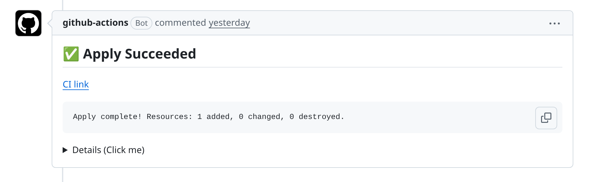
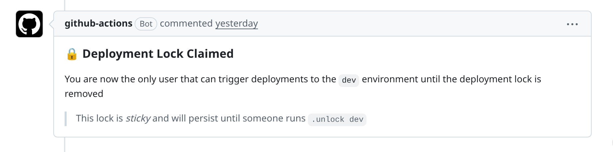

# Commands

Commands are pull request comments. Terraform Branch Deploy uses Branch Deploy's IssueOps model: the comment is parsed by Branch Deploy, checked against repository policy, and then executed by Terraform Branch Deploy when the command is allowed to continue.

The default command set is:

| Command | Purpose |
| --- | --- |
| `.plan to <env>` | Run `terraform plan`, post the result, and save the plan. |
| `.apply to <env>` | Apply the saved plan for the same environment and commit. |
| `.apply main to <env>` | Roll back by applying the stable branch directly. |
| `.lock <env>` | Lock one environment. |
| `.unlock <env>` | Unlock one environment. |
| `.lock --global` | Lock all environments. |
| `.unlock --global` | Unlock all environments. |
| `.wcid` | Show current lock ownership. |
| `.help` | Show available commands. |

!!! tip "Prefer explicit environments"

    Use commands such as `.plan to dev` and `.apply to prod`. Set `disable-naked-commands: true` so a comment cannot silently target the default environment.

## Examples

- `.plan to dev`: Plans the `dev` environment.
- `.apply to dev`: Applies the saved `dev` plan for the current commit.
- `.plan to prod | -target=module.database`: Plans `prod` with extra Terraform arguments.
- `.apply main to prod`: Applies the stable branch to `prod`.
- `.lock prod`: Prevents deployments to `prod` until it is unlocked or released.
- `.unlock prod`: Releases the `prod` lock.

## Plan

```text
.plan to <env>
```

Plan runs `terraform init` and `terraform plan` for the selected environment. The plan output is posted to the pull request. The plan file and metadata are saved for later apply.


## Apply

```text
.apply to <env>
```

A normal apply requires a saved plan. If new commits are pushed after planning, run `.plan to <env>` again.

Apply restores the saved plan for the environment and commit SHA. It does not create a fresh plan during a normal apply.

Saved plan metadata is required and verified before the plan is applied. Re-plan to replace older cached plans that do not have metadata.


## Rollback

```text
.apply main to <env>
```

Rollback checks out the configured stable branch and runs Terraform apply directly. Use this path when the goal is to restore an environment from the stable branch rather than apply a pull request plan.

Rollback does not require a saved plan.




## Locks

```text
.lock <env>
.unlock <env>
.wcid
```

Use locks to pause deployment to an environment during maintenance or incident response.

Locks are released automatically after deployment unless sticky lock mode is enabled. When sticky locks are enabled, release the lock manually:

```text
.unlock prod
```




## Extra Terraform Arguments

Add command-specific Terraform arguments after the configured separator. The default separator is `|`.

```text
.plan to prod | -target=module.database
```

Common examples:

- `.plan to dev | -target=module.api`: Plans only `module.api`.
- `.plan to dev | -var='replicas=3'`: Adds a Terraform variable.
- `.plan to dev | -refresh=false`: Skips refresh for that plan.

Extra arguments from `.plan` are part of the saved plan. A later `.apply to <env>` applies that saved plan without needing to repeat those arguments.


!!! warning "Extra arguments are plan-only"

    A targeted plan is applied with the normal apply command:

    ```text
    .plan to prod | -target=module.database
    .apply to prod
    ```

    The apply step uses the saved targeted plan. Terraform Branch Deploy rejects extra Terraform arguments on `.apply` and rollback commands.


## Branch Deploy Mapping

Terraform Branch Deploy maps Terraform operations onto Branch Deploy command types:

| Terraform Branch Deploy | Branch Deploy behavior |
| --- | --- |
| `.plan` | Uses the Branch Deploy noop command path. |
| `.apply` | Uses the Branch Deploy deploy command path. |
| `.apply main` | Uses the Branch Deploy stable branch rollback path. |
| `.lock`, `.unlock`, `.wcid`, `.help` | Passed through to Branch Deploy. |

The command triggers can be renamed with action inputs:

```yaml
- uses: scarowar/terraform-branch-deploy@v0
  with:
    mode: trigger
    github-token: ${{ secrets.GITHUB_TOKEN }}
    noop-trigger: ".tf plan"
    trigger: ".tf apply"
    lock-trigger: ".tf lock"
    unlock-trigger: ".tf unlock"
```

See [Inputs](inputs.md) for all trigger inputs.
