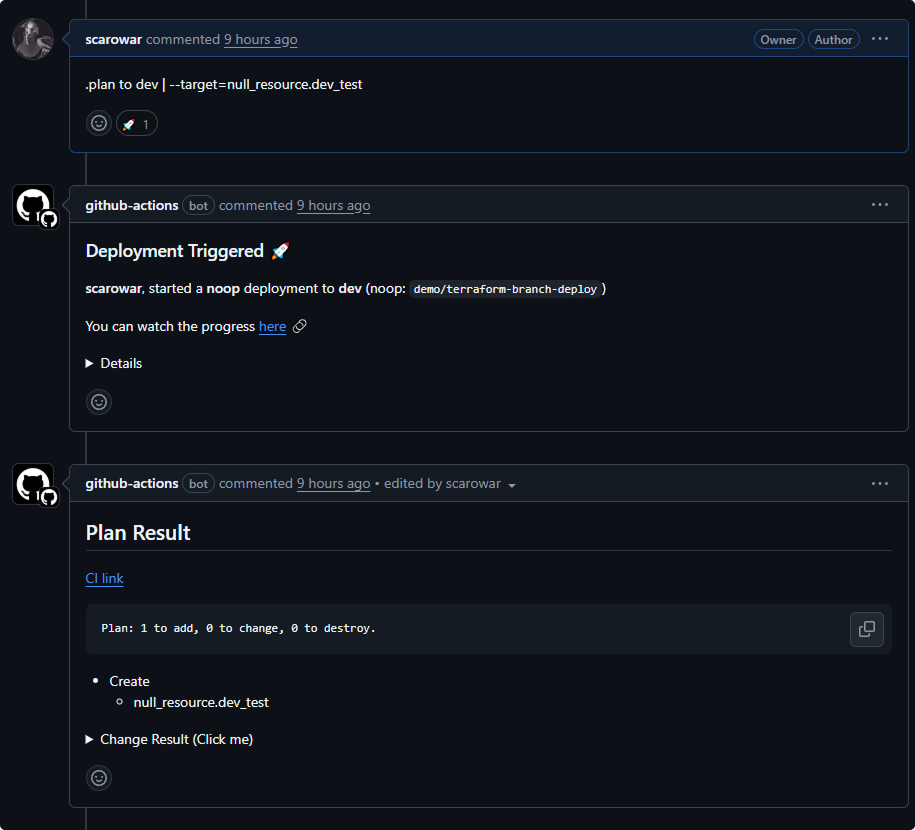

# Commands

All commands are posted as comments on pull requests.

---

## Plan

Preview infrastructure changes.

```bash
.plan to <env>
```

| Example | Effect |
|---------|--------|
| `.plan to dev` | Plan changes to dev |
| `.plan to prod` | Plan changes to prod |


The plan output is posted as a PR comment:


---

## Apply

Apply the reviewed plan.

```bash
.apply to <env>
```

!!! warning "Requires Plan"
    A plan must exist for the current commit SHA. If you push new commits after planning, you must re-plan.


The apply result is posted as a PR comment:


---

## Rollback

Deploy the main branch directly.

```bash
.apply main to <env>
```

This bypasses the plan requirement and applies the stable main branch immediately. Use this as an emergency latch to restore production to a known-good state.

---

## Lock

Acquire an exclusive lock on an environment.

```bash
.lock <env>
```

Use this for maintenance windows or to prevent deployments during incidents.


---

## Unlock

Release the lock on an environment.

```bash
.unlock <env>
```

Locks are automatically released when deployments complete. Manual unlock is only needed for stuck locks or when using sticky lock mode.


---

## Status

Check who is currently deploying.

```bash
.wcid
```

Shows the current lock status for all environments.


---

## Help

Display available commands.

```bash
.help
```

---

## Extra Arguments

Pass additional arguments to Terraform using a pipe separator:

```bash
.plan to prod | -target=module.database
```

| Example | Effect |
|---------|--------|
| `.plan to dev \| -target=module.api` | Plan only the API module |
| `.plan to dev \| -var='count=3'` | Pass a variable |
| `.plan to dev \| -refresh=false` | Skip refresh |


