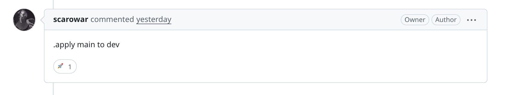
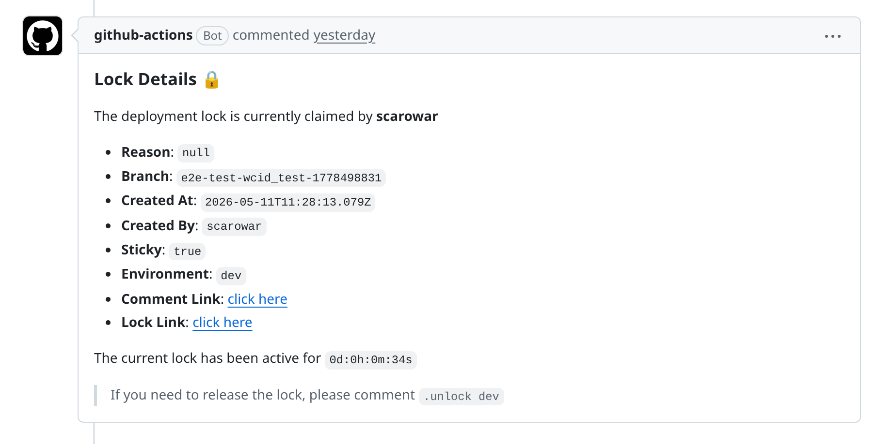

# Security

Terraform Branch Deploy combines Branch Deploy's IssueOps controls with Terraform-specific saved plan handling. Treat the two layers separately when reviewing a workflow.

## IssueOps Security Model

Use `issue_comment` for Terraform Branch Deploy workflows:

```yaml
on:
  issue_comment:
    types: [created]
```

Issue comment workflows run from the workflow file on the default branch. A pull request author cannot change the deployment workflow in the same pull request and then trigger that changed workflow by commenting on the PR.

Do not use `pull_request_target` for Terraform Branch Deploy. That trigger is privileged and is intended for narrow PR metadata automation. It must not be combined with checking out or running pull request code.

Keep the job guarded so plain issue comments do not run deployment logic:

```yaml
jobs:
  deploy:
    if: github.event.issue.pull_request
```

## Inherited Branch Deploy Controls

Branch Deploy handles who can issue commands and when a command may continue.

| Area | Control |
| --- | --- |
| Command source | Commands are parsed from pull request comments. |
| Actor authorization | `permissions`, `admins`, and `admins-pat` control who can run commands. |
| Reviews and checks | `checks`, `required-contexts`, `skip-ci`, and `skip-reviews` control required gates. |
| Branch state | `outdated-mode`, `update-branch`, `allow-sha-deployments`, and target-branch settings control what ref may deploy. |
| Forks | Forked pull request deployment is not enabled by this action. |
| Deployments and locks | Branch Deploy creates deployment records and manages environment locks. |
| Promotion | `enforced-deployment-order` and `deployment-confirmation` can add production flow controls. |

Do not bypass the state exported by trigger mode. Later steps should use `TF_BD_CONTINUE`, `TF_BD_REF`, `TF_BD_ENVIRONMENT`, and `TF_BD_OPERATION` instead of re-parsing the comment or inventing a checkout ref.

Recommended production-oriented defaults:

```yaml
- uses: scarowar/terraform-branch-deploy@v0
  with:
    mode: trigger
    github-token: ${{ secrets.GITHUB_TOKEN }}
    disable-naked-commands: true
    checks: all
    outdated-mode: strict
    update-branch: warn
```

For smaller repositories, `checks: required` can be appropriate when branch protection defines the release gates.

## GitHub Actions Hardening Baseline

Follow GitHub's secure-use guidance for every workflow that can deploy infrastructure:

- Keep `GITHUB_TOKEN` permissions explicit and scoped to the job.
- Pass PR-controlled values through `env`, action inputs, or CLI arguments; do not interpolate event or comment values directly into shell scripts.
- Write values to `GITHUB_ENV` and `GITHUB_OUTPUT` with the multiline file-command format when values can contain arbitrary text.
- Pin third-party actions to a full commit SHA in production workflows.
- Avoid self-hosted runners for public or untrusted pull request deployments unless they are isolated and disposable.
- Review workflow logs after valid and invalid commands to confirm secrets and Terraform variables are not printed.

## Terraform Saved Plan Controls

Terraform Branch Deploy handles the Terraform execution path after Branch Deploy allows a command to continue.

| Area | Control |
| --- | --- |
| Environment scope | Execute mode validates the requested environment against `.tf-branch-deploy.yml`. |
| Normal apply | `.apply to <env>` requires a saved plan file for the environment and commit SHA. |
| Cache miss behavior | If the saved plan is not restored, apply fails instead of running an untargeted apply. |
| Saved plan consistency | New plans include metadata with environment, commit SHA, checksum, Terraform version, extra arguments, params hash, and creation time. |
| Metadata verification | Apply requires valid metadata. Re-plan to replace older cached plans without metadata. |
| Targeted plans | Extra plan arguments are captured in the saved plan; apply uses that saved plan. |
| Rollback | `.apply main to <env>` is a separate stable branch apply path and does not use a PR plan. |

Saved plan files and metadata are restored from GitHub Actions cache. The metadata check helps catch mismatches between the restored plan and the current command context; it is not an independent tamper-proof artifact store.

## Plan Before Apply

Normal apply should be:

```text
.plan to prod
.apply to prod
```

The saved plan is tied to the environment and commit SHA. If new commits are pushed, run the plan again.

!!! warning "Do not use apply as a second plan"

    Normal apply must apply the saved plan from the matching `.plan` command. For example, a targeted plan followed by a plain apply should apply that targeted saved plan, not create a new untargeted apply.

Targeted plans follow the same rule:

```text
.plan to prod | -target=module.database
.apply to prod
```

The apply restores the saved targeted plan. It does not create a fresh plan.


## Rollback

Rollback uses the stable branch:

```text
.apply main to prod
```

Rollback is intentionally separate from normal apply. It applies the stable branch directly and does not require a saved pull request plan.



## Workflow Permissions

Use the least permissions that still support comments, checkout, deployments, locks, and checks:

```yaml
permissions:
  contents: write
  pull-requests: write
  deployments: write
  checks: read
  statuses: read
```

Add `id-token: write` when cloud credential setup uses GitHub OIDC.

Grant admin bypass sparingly. Prefer named users or a narrowly scoped team, and protect any `admins-pat` secret.

## Checkout and Credentials

A workflow may do an initial default-branch checkout before trigger mode so the action can read `.tf-branch-deploy.yml`. Do not check out the target ref or configure cloud credentials until Branch Deploy accepts the command:

```yaml
- uses: actions/checkout@v6
  if: env.TF_BD_CONTINUE == 'true'
  with:
    ref: ${{ env.TF_BD_REF }}

# Configure cloud credentials here.
```

This keeps cloud credentials behind Branch Deploy's command, permission, check, and lock decisions.

For production workflows, pin third-party actions such as `actions/checkout` and cloud authentication actions by full commit SHA. The examples in these docs use version tags for readability.

Terraform Branch Deploy examples use `scarowar/terraform-branch-deploy@v0` so they follow the latest v0 release. For a stricter supply-chain posture, replace the tag with the full commit SHA for the release you reviewed.

## Branch and Fork Settings

| Input | Recommended production value | Why |
| --- | --- | --- |
| `outdated-mode` | `strict` | Avoid deploying stale pull request branches. |
| `update-branch` | `warn` | Surface drift without rewriting contributor branches. |
| `allow-sha-deployments` | `false` | Keep deployments tied to reviewed pull request refs. |
| `allow-non-default-target-branch` | `false` | Keep release flow on the default branch unless you use release branches. |
| `commit-verification` | project-specific | Enable when verified commits are required by policy. |

## Repository Rulesets

Branch Deploy assumes the repository has a release discipline around the stable branch. Protect the default branch or matching ruleset before relying on deployments for production infrastructure.

Recommended ruleset checks:

- Prevent force pushes and branch deletion on the stable branch.
- Require pull requests before merging to the stable branch.
- Require current status checks before merge.
- Dismiss stale approvals when new commits are pushed.
- Require code owner review when ownership matters.
- Use required deployments when your release process depends on GitHub environments.

## Locks

Use locks during maintenance or incident response:

```text
.lock prod
.wcid
.unlock prod
```

By default, deployment locks are released after completion. Use `sticky-locks: true` only when a person should release the lock manually.



## Production Promotion

Mark production environments in `.tf-branch-deploy.yml`:

```yaml
production-environments: [prod, prod-eu]
```

Use Branch Deploy controls for stricter production flow:

```yaml
with:
  enforced-deployment-order: "dev,staging,prod"
  deployment-confirmation: true
  deployment-confirmation-timeout: 300
```

## Practical Checklist

- Use `disable-naked-commands: true`.
- Require CI with `checks: all` or `checks: required`.
- Keep `outdated-mode: strict` for production.
- Do not run Terraform Branch Deploy on forked pull requests.
- Keep `allow-sha-deployments: false` unless there is a specific operational need.
- Limit `admins` and protect any `admins-pat` secret.
- Define every production target in `production-environments`.
- Run `.plan to <env>` again after new commits.
- Use `.apply main to <env>` only for rollback.
