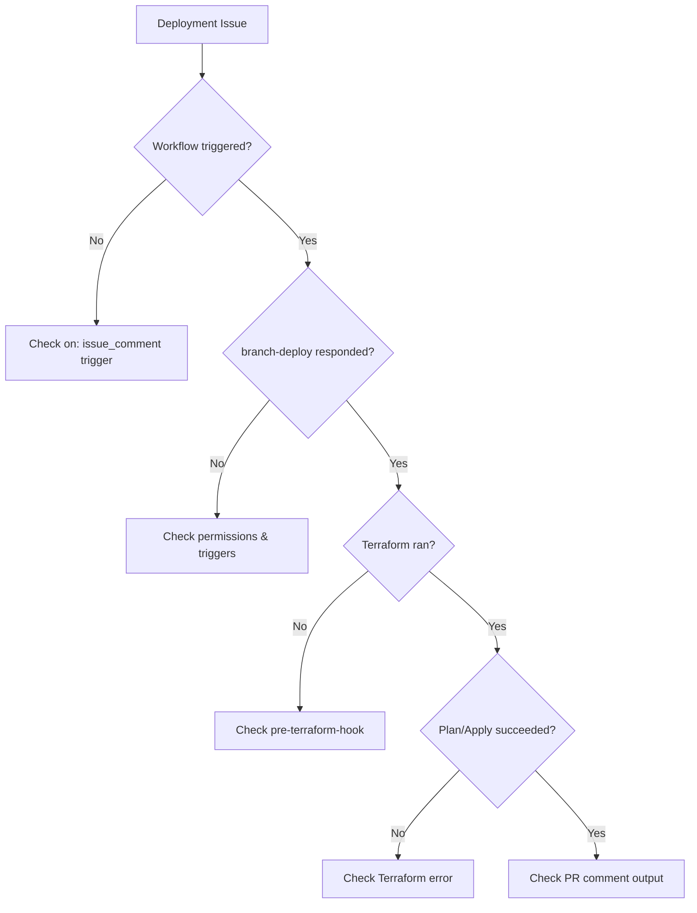

# Troubleshooting

## Debugging Flowchart



---

## Common Issues

### "No plan file found for this SHA"

**Cause:** You tried to `.apply` without running `.plan` first, or new commits changed the SHA.

**Fix:**

1. Run `.plan to <env>` first
2. If you made new commits after planning, run `.plan` again
3. The plan is tied to a specific commit SHA for safety

```text
❌ .apply to dev
   → Error: No plan file found for SHA abc123

✅ .plan to dev
   → Plan saved for SHA abc123

✅ .apply to dev
   → Applies the saved plan
```

---

### "Environment not found"

**Cause:** The environment in your command doesn't exist in `.tf-branch-deploy.yml`.

**Fix:**

1. Check your config file for typos
2. Environment names are **case-sensitive**
3. Ensure the `environments` section includes your target

```yaml
environments:
  dev:           # ✅ .plan to dev
    working-directory: terraform/dev
  Dev:           # ✅ .plan to Dev (different!)
    working-directory: terraform/Dev
```

---

### "Config file not found"

**Cause:** `.tf-branch-deploy.yml` doesn't exist in the repository root.

**Fix:**

1. Create the config file in your repository root
2. Or specify a custom path:

```yaml
- uses: scarowar/terraform-branch-deploy@v0.2.0
  with:
    github-token: ${{ secrets.GITHUB_TOKEN }}
    config-path: terraform/.tf-branch-deploy.yml
```

---

### "Branch is outdated"

**Cause:** Your PR branch is behind the target branch (`main`).

**Fix:**

The fix depends on your `update-branch` and `outdated-mode` settings:

=== "update-branch: warn (default)"

    You'll see a warning but deployment proceeds. Consider updating your branch:

    ```bash
    git fetch origin main
    git merge origin/main
    git push
    ```

=== "update-branch: force"

    The action will auto-update your branch. This may re-trigger CI.

=== "outdated-mode: strict"

    Deployment is blocked until you update:

    1. Click "Update branch" in the GitHub PR UI
    2. Or merge main into your branch manually

---

### "Environment locked by another PR"

**Cause:** Another user has locked the environment.

**Fix:**

1. Check who has the lock: `.wcid`
2. Ask them to unlock or wait for their deployment
3. If lock is stuck, unlock from any PR: `.unlock <env>`

!!! note "Sticky Locks"
    If `sticky-locks: true`, locks persist after deployment. The deployer must manually `.unlock`.

---

### "Deployment order violation"

**Cause:** You have `enforced-deployment-order` set and tried to skip an environment.

**Fix:**

If your config has:
```yaml
enforced-deployment-order: "dev,staging,prod"
```

You must deploy to `dev`, then `staging`, before `prod`:

```text
❌ .apply to prod
   → Error: Must deploy to staging before prod

✅ .apply to dev
✅ .apply to staging
✅ .apply to prod
```

---

### Plan Output Not Appearing in PR

**Cause:** `tfcmt` issue or GitHub token permissions.

**Fix:**

1. Ensure your token has `pull-requests: write`:

```yaml
permissions:
  contents: write
  pull-requests: write
  deployments: write
```

2. Check the workflow logs for tfcmt errors
3. The action installs tfcmt automatically—no setup needed

---

### "Permission denied" Errors

**Cause:** GitHub token missing required permissions.

**Fix:**

Add all required permissions to your workflow:

```yaml
permissions:
  contents: write       # For checkout and branch operations
  pull-requests: write  # For PR comments
  deployments: write    # For deployment status
  checks: read          # If using checks validation
  statuses: read        # If using required contexts
```

---

### Pre-Terraform Hook Fails

**Cause:** Hook script exited with non-zero code.

**Fix:**

1. Check the workflow logs for the error
2. Use `set -e` to fail on first error:

```yaml
pre-terraform-hook: |
  set -e
  ./scripts/build.sh
```

3. Test your hook locally:

```bash
export TF_BD_ENVIRONMENT=dev
export TF_BD_SHA=$(git rev-parse HEAD)
export TF_BD_OPERATION=plan
./your-hook.sh
```

---

### Environment Lock Stuck

**Cause:** Previous deployment failed without releasing lock.

**Fix:**

Comment `.unlock <env>` on **any** open PR:

```text
.unlock dev
```

!!! warning "Global Lock"
    If someone used `.lock --global`, you need `.unlock --global` to release all environments.

---

### "Admin bypass not working"

**Cause:** Admin team lookup failing.

**Fix:**

If using GitHub teams in `admins`:

1. Ensure `admins-pat` is set with a PAT that has `read:org` scope
2. Team format is `org-name/team-slug` (not display name)
3. The PAT owner must be able to view team membership

```yaml
# Correct
admins: "my-org/platform-team"
admins-pat: ${{ secrets.ADMIN_PAT }}

# Wrong - missing PAT
admins: "my-org/platform-team"

# Wrong - display name instead of slug
admins: "my-org/Platform Team"
```

---

### Cache/Artifact Not Found

**Cause:** Plan cache expired or different SHA.

**Fix:**

- GitHub Actions cache expires after 7 days of no access
- New commits = new SHA = new cache key
- Run `.plan` again to regenerate

---

## Debug Mode

Enable verbose logging:

```yaml
env:
  ACTIONS_STEP_DEBUG: true
  ACTIONS_RUNNER_DEBUG: true
```

This shows:

- Full terraform command output
- branch-deploy internal state
- Cache operations

---

## Dry Run Mode

Test without executing terraform:

```yaml
- uses: scarowar/terraform-branch-deploy@v0.2.0
  with:
    github-token: ${{ secrets.GITHUB_TOKEN }}
    dry-run: true
```

This prints commands that would run without executing them.

---

## Getting Help

- 📖 [Documentation](https://scarowar.github.io/terraform-branch-deploy/)
- 🐛 [GitHub Issues](https://github.com/scarowar/terraform-branch-deploy/issues)
- 💬 [GitHub Discussions](https://github.com/scarowar/terraform-branch-deploy/discussions)

When reporting issues, include:

1. Workflow file (sanitized)
2. `.tf-branch-deploy.yml` config
3. Error message from logs
4. PR comment that triggered the issue
