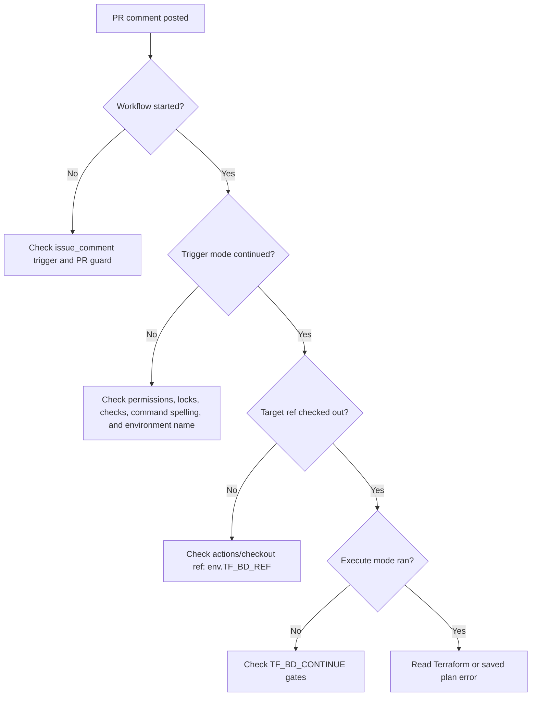

# Troubleshooting

Start with the workflow run for the PR comment. The failure usually belongs to one of four areas: trigger mode, checkout and credentials, execute mode, or Terraform itself.

## Quick Checks


```mermaid
flowchart TD
    Comment["PR comment posted"] --> Started{"Workflow started?"}
    Started -- No --> Trigger["Check issue_comment trigger and PR guard"]
    Started -- Yes --> Continued{"Trigger mode continued?"}
    Continued -- No --> BranchDeploy["Check permissions, locks, checks, command spelling, and environment name"]
    Continued -- Yes --> Checkout{"Target ref checked out?"}
    Checkout -- No --> Ref["Check actions/checkout ref: env.TF_BD_REF"]
    Checkout -- Yes --> Execute{"Execute mode ran?"}
    Execute -- No --> Gate["Check TF_BD_CONTINUE gates"]
    Execute -- Yes --> Terraform["Read Terraform or saved plan error"]
```

## Workflow Does Not Start

Check the event and PR guard:

```yaml
on:
  issue_comment:
    types: [created]

jobs:
  deploy:
    if: github.event.issue.pull_request
```

The command must be a comment on a pull request, not on a commit or plain issue.

## Trigger Mode Does Not Continue

If `TF_BD_CONTINUE` is not `true`, Branch Deploy decided execution should stop.

Common causes:

- The comment is not a supported command.
- The target environment is unknown.
- The user does not have the required repository permission.
- Required checks or reviews are not complete.
- The environment is locked.
- The PR is outdated according to your Branch Deploy inputs.

Use `.wcid` to inspect locks.

## Execute Mode Runs When It Should Not

Every target-ref checkout, credential step, and execute-mode step after trigger mode should be gated:

```yaml
if: env.TF_BD_CONTINUE == 'true'
```

Without the gate, later steps may run after an ignored or unauthorized comment.

## Wrong Ref Checked Out

Execute mode should run against `TF_BD_REF`:

```yaml
- uses: actions/checkout@v6
  if: env.TF_BD_CONTINUE == 'true'
  with:
    ref: ${{ env.TF_BD_REF }}
```

Do not rely on the default checkout ref for issue comment workflows.

## No Plan File Found

This means apply could not find a valid saved plan for the commit and environment.

Fix:

```text
.plan to dev
.apply to dev
```

If new commits were pushed after planning, run the plan again. Plans are tied to the commit SHA.

## Targeted Plan Was Not Applied

Use the same simple apply command after a targeted plan:

```text
.plan to prod | -target=module.database
.apply to prod
```

The apply should restore and apply the saved plan. If it reports no saved plan, re-run `.plan to prod | -target=module.database` and inspect the workflow logs for cache restore messages.

## Environment Not Found

Environment names come from `.tf-branch-deploy.yml` unless you override them with workflow inputs.

```yaml
environments:
  dev:
    working-directory: terraform/dev
```

Environment names are case-sensitive. `.plan to Dev` and `.plan to dev` are different.

## Config File Not Found

The default config path is `.tf-branch-deploy.yml`. If your file lives elsewhere, set `config-path` on both action calls:

```yaml
- uses: scarowar/terraform-branch-deploy@v0
  with:
    mode: trigger
    github-token: ${{ secrets.GITHUB_TOKEN }}
    config-path: terraform/.tf-branch-deploy.yml

- uses: scarowar/terraform-branch-deploy@v0
  if: env.TF_BD_CONTINUE == 'true'
  with:
    mode: execute
    github-token: ${{ secrets.GITHUB_TOKEN }}
    config-path: terraform/.tf-branch-deploy.yml
```

## Token Permission Errors

Use workflow permissions that match the features you enable:

```yaml
permissions:
  contents: write
  pull-requests: write
  issues: write
  deployments: write
  checks: read
  statuses: read
```

Team-based admin checks also require `admins-pat` with access to read team membership.

## Branch Is Outdated

If `outdated-mode: strict` blocks deployment, update the PR branch and wait for required checks.

With `update-branch: warn`, Branch Deploy warns but can continue. With `update-branch: force`, Branch Deploy may update the branch automatically.

## Environment Is Locked

Check lock ownership:

```text
.wcid
```

Unlock after confirming it is safe:

```text
.unlock dev
```

For global locks:

```text
.unlock --global
```

## Deployment Order Violation

If `enforced-deployment-order` is set, deploy in that order:

```yaml
enforced-deployment-order: "dev,staging,prod"
```

Then:

```text
.apply to dev
.apply to staging
.apply to prod
```

## Terraform Fails

Read the execute-mode logs. Most Terraform failures are normal Terraform problems:

- Provider authentication is missing or points at the wrong account.
- Backend configuration is wrong.
- A `var-files` path is wrong.
- Terraform code failed validation or planning.
- The target cloud API returned an authorization or quota error.

Use `dry-run: true` to print commands without executing Terraform:

```yaml
- uses: scarowar/terraform-branch-deploy@v0
  with:
    mode: execute
    github-token: ${{ secrets.GITHUB_TOKEN }}
    dry-run: true
```

`dry-run` only changes Terraform execution in execute mode. Trigger-mode parsing, Branch Deploy lifecycle behavior, and any earlier workflow steps can still run.

## Debug Logs

Enable GitHub Actions debug logging from repository settings, or set these secrets to `true`:

- `ACTIONS_STEP_DEBUG`
- `ACTIONS_RUNNER_DEBUG`

When opening an issue, include the sanitized workflow, `.tf-branch-deploy.yml`, command comment, and relevant workflow log excerpt.
